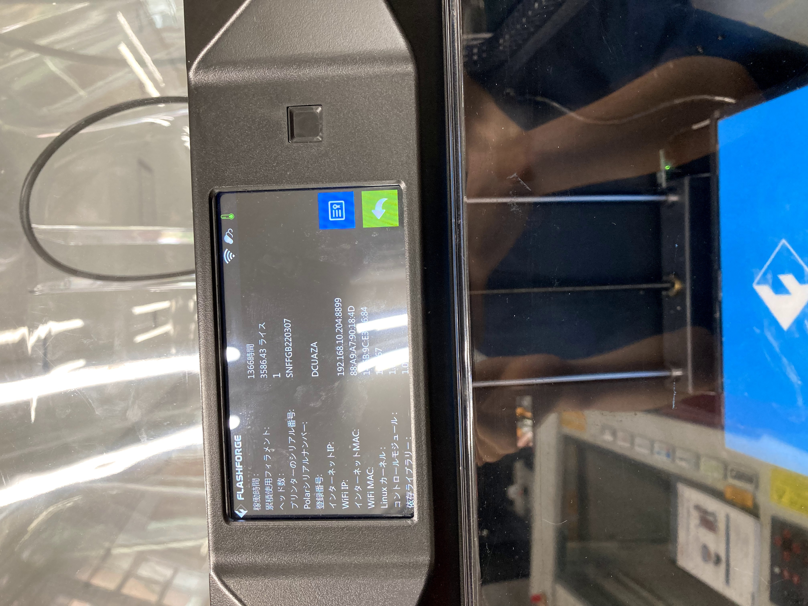
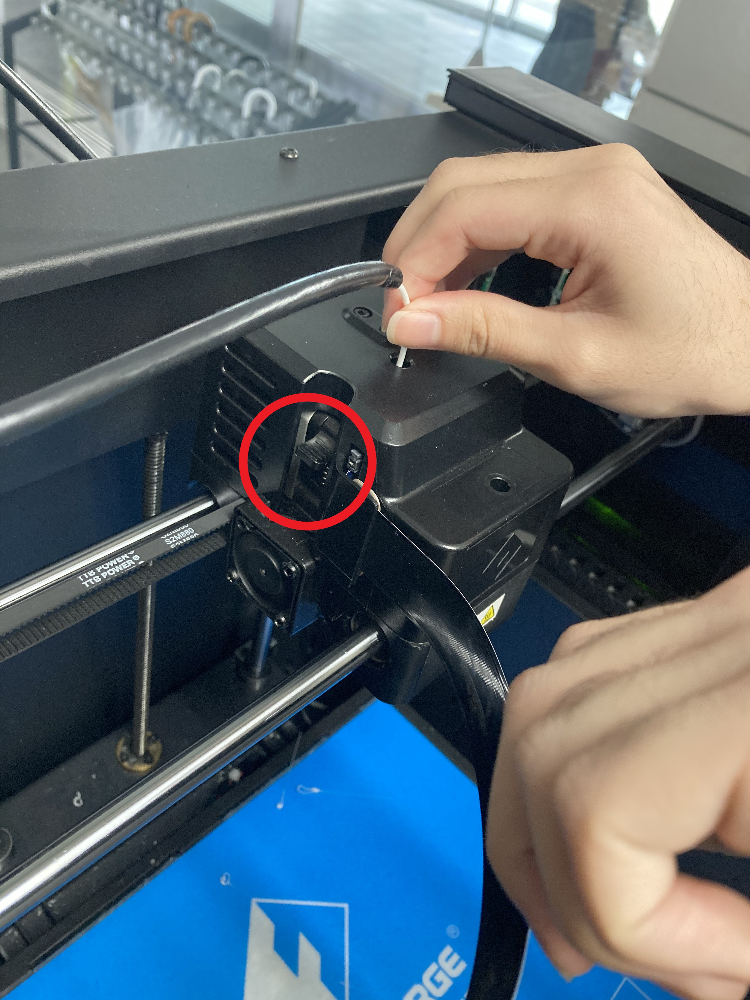
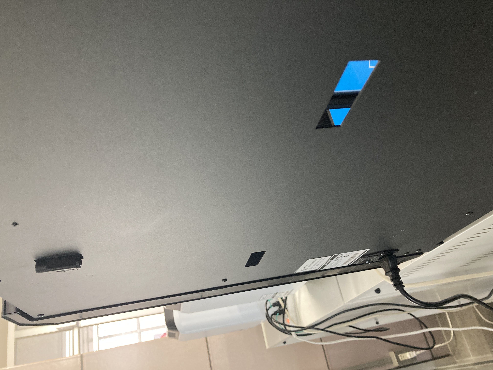
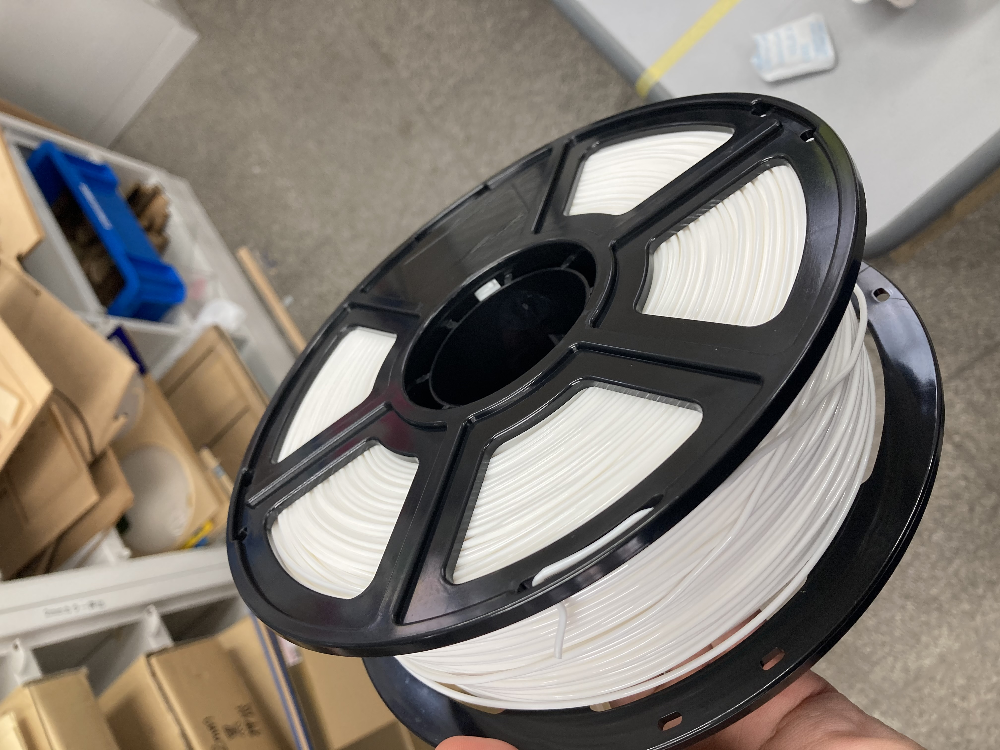
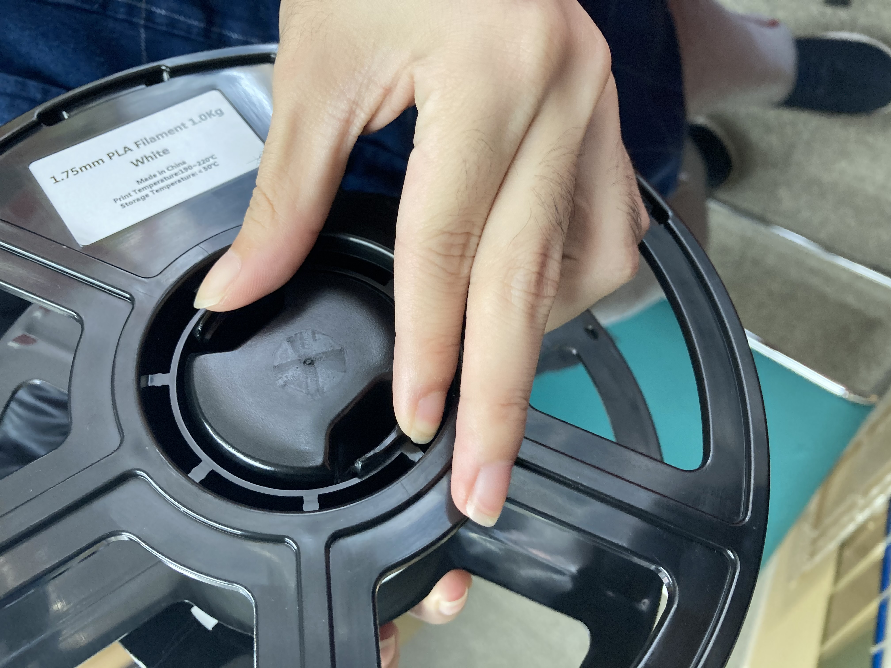
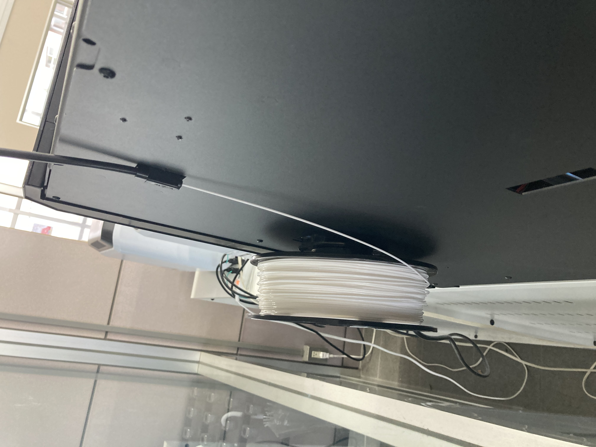

# Aizu Geek Dojo 講習 (3Dプリンタ Guider2の使い方)

## 目次

- [1.Guider2の概要](#1Guider2の概要)
- [2.印刷する際の流れ](#2印刷する際の流れ)
- [3.樹脂の交換](#3樹脂の交換)

### 1.Guider2の概要

- Guider Ⅱ
    最大加工寸法  
    280W x 250D x 300H mm

### 2.印刷する際の流れ

1. 電源を入れる  
  裏側にある電源を入れるとテレレ～！と音楽のようなものが流れます。

2. IPアドレスを確認する  
  起動後のホーム画面からタッチパネルを操作して「ツール」から「その他」を開いて確認します。

 

3. FlashPrintを起動して先ほどのIPアドレスに対してGコードを送信する  
  FlashPrintでのデータの作成方法やGコードの送信方法についてはこちらをご覧ください。  
  [FlashPrintの使い方](./FlashPrintの使い方)

 

4. 完成したら作品を取り出す  
  以下の写真のようにプレートの下側を押し込みながら手前に引くことでプレートごと取り出せます。  
  プレートごと取り出したらヘラを使って作品を取り出しましょう。  
  プレートに樹脂が残っていると次の印刷時に失敗する可能性があるのでプレートに残っている樹脂はなるべく取り除きましょう。

 

### 3.樹脂の交換

1. 内部にある樹脂を取り出す
  タッチパネルを操作して「ツール」から「フィラメントを交換」を押します。
  「フィラメントを交換」から「取出」を押します。
  「取出」を押すと加熱が始まり、準備ができたらピピッと音がします。
  上の透明カバーを外して、レバーを押しながら樹脂を取り出します。※強くレバーを押す必要があるので、親指などで押しましょう。

 

2. 取り付けられている樹脂本体を取り外す  
  機器の裏側にある樹脂本体を取り外します。

 

3. 新しい樹脂本体を取り付ける  
  袋を開けて新しい樹脂を取り出します。色の変更などであれば袋から取り出した新しいものでなくても印刷に十分な量のあるものを使っていただいても問題ありません。  
  Guider2用の樹脂本体はAdventurer3のものよりも一回り大きいので気を付けましょう。  
  回転する向きに注意しながら樹脂本体を取り付けます。  
  その際、管に樹脂の先端を入れます。

 

4. 樹脂がノズルから出てくるか確認する  
  先ほどの管を取り付けます。
  その後、タッチパネルを操作して「フィラメントを交換」から「押出」を押します。
  ノズルから樹脂が出てきたことを確認してから止めます。  
  止めないと動き続けるので放置しないようにしましょう。

 

5. カバーを元に戻す  
  交換し終わったら上の透明なカバーを元通りにかぶせておしまいです。