# Aizu Geek Dojo 講習 (3Dプリンタ④)

## **目次**

- アプリの操作方法
- 覚えておくといいこと

  

## **アプリの操作方法**

### 1. UP Studioを起動
アイコンをクリック

起動直後は下のようなホーム画面が出てきます。

画面左側にある「UP」ボタンをクリックし、モデルの配置画面に切り替えます。

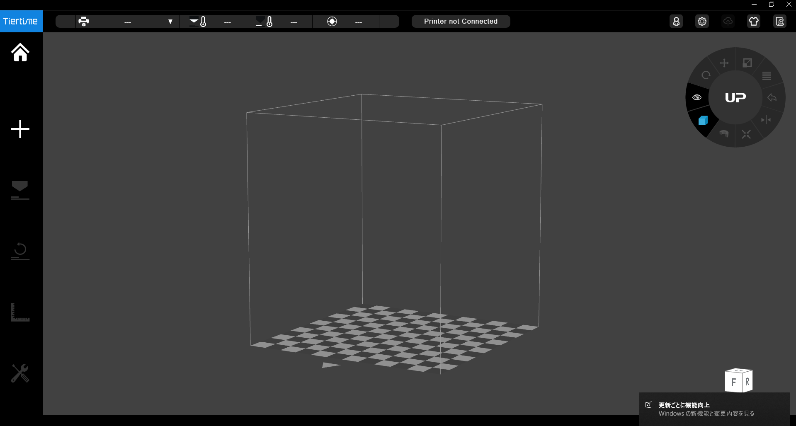

### 2. 3Dプリンタを選択
右上にある歯車をクリックすると設定画面が開きます。

「Printer」をクリックし、使用するプリンタを選択してください。

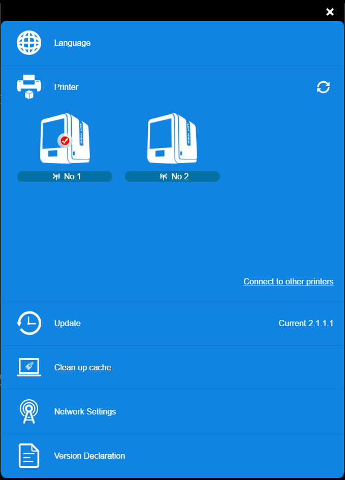

または画面左上のバーからも同様に選択できます。

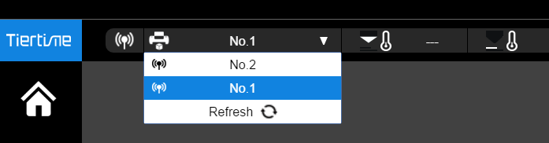

### 3. 初期化
まず出力する前に、画面左側の「↪」ボタンをクリックしてプリンターを初期化します。
<!-- 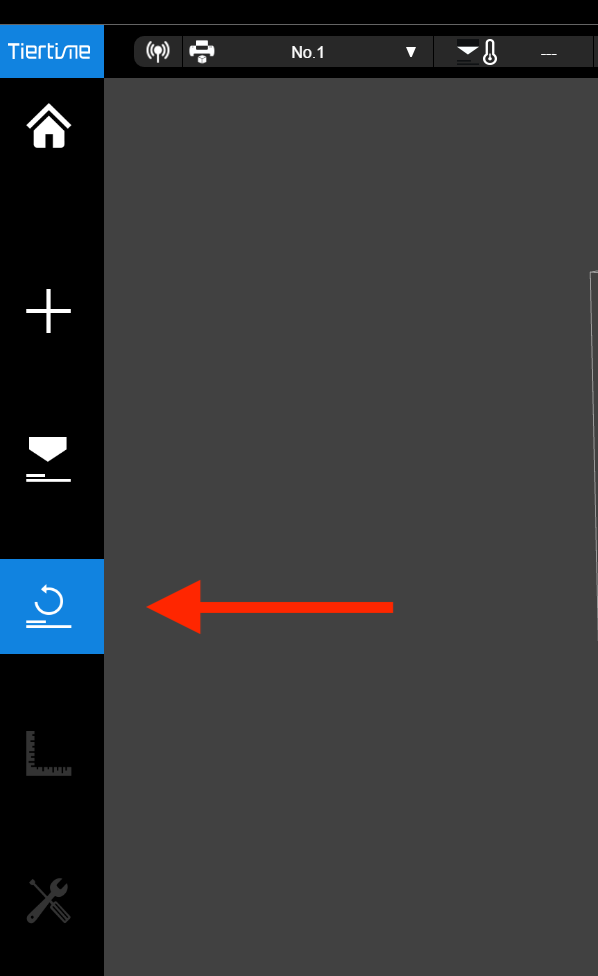 -->

> またはプリンター本体の操作でも同様に初期化できます。
- UPminiの場合 - 画面で右下の「初期化」→「✔︎」を選択

<!--  -->

- UPBoxの場合 - 右にある3つのボタンのうちの左のボタンを長押し

<!-- 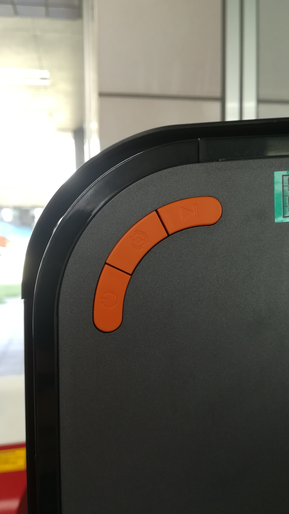 -->

右上のステータスバーに「Printer Ready」が表示されたら完了。

### 4. データを配置
画面左側にある「+」ボタンを選択し、出てきたメニューの左側の「Add 3D Model」をクリックします。

<!-- 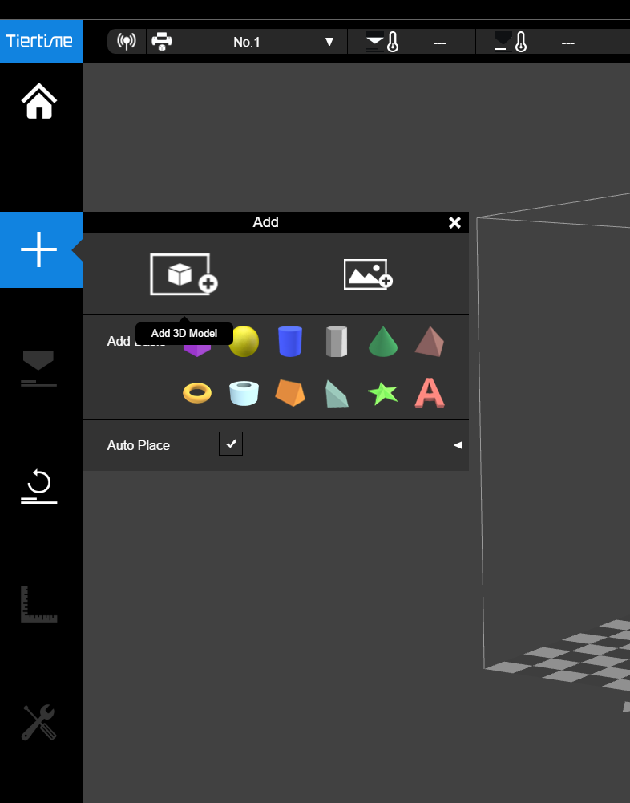 -->

ファイルを選択すると、中央のモデル配置画面に3Dモデルが表示されます。

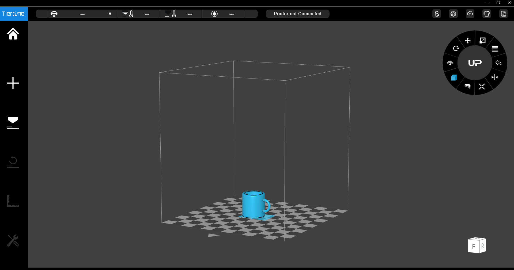

右上のツールで配置などを調整します。(参照：覚えておくといいこと)

### 5. オプションを設定して出力

画面左側の「Print」ボタンで設定画面を開きます。

<!-- 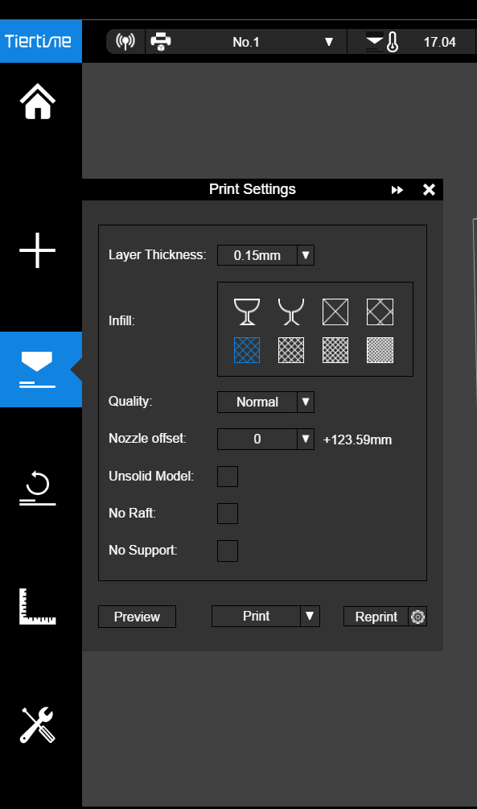 -->

必要なオプションを設定します。(参照：覚えておくといいこと)

右下の「Preview」で出力時間・マテリアルの量を確認。

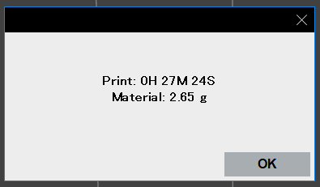

マテリアルの残量が足りるか確認したらいざ、出力。
「Print」ボタンでスタートします。

  

## **覚えておくといいこと**

- 配置の調整方法 - 右上のツールを使います

    - **位置** - 十字ボタンで各軸ごとに移動できます

        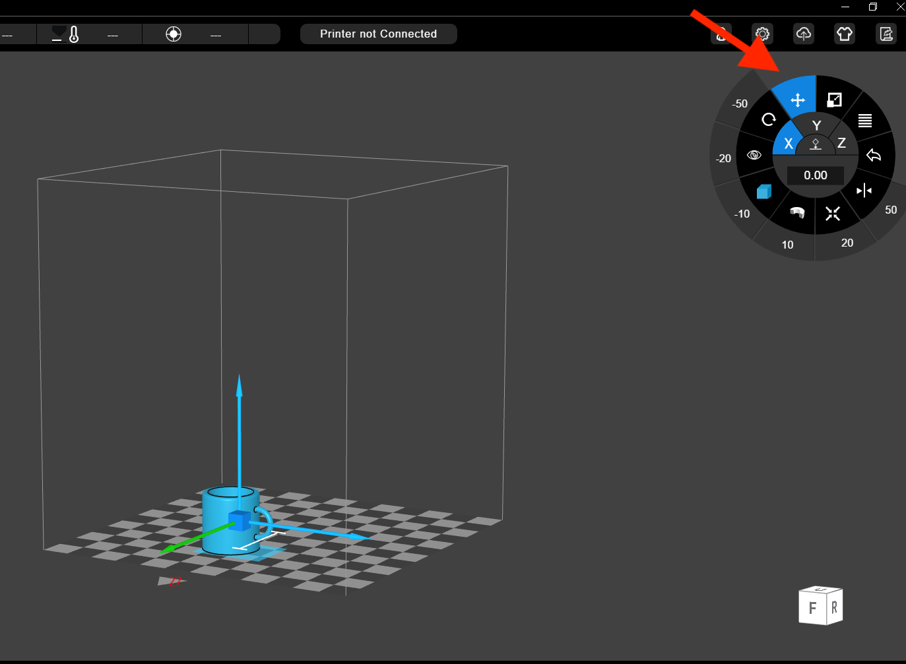

        または「Auto Place」を押すと、自動的に位置調整をしてくれます。

        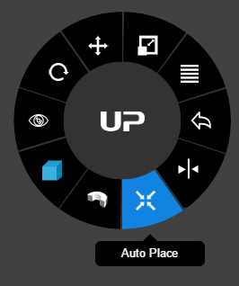

    - **回転**

        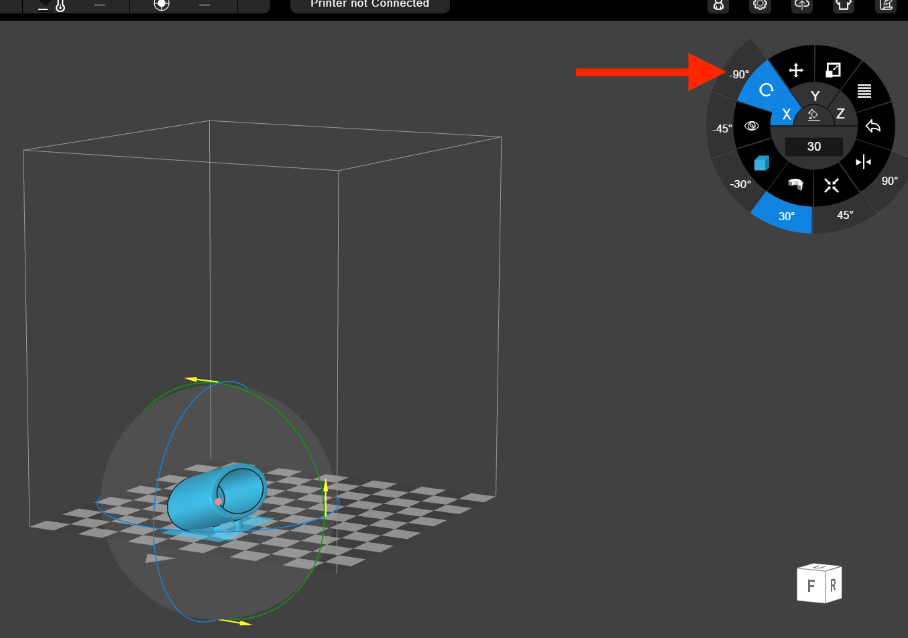

    - **大きさ** - プリンターの大きさに合わせて拡大・縮小できます

        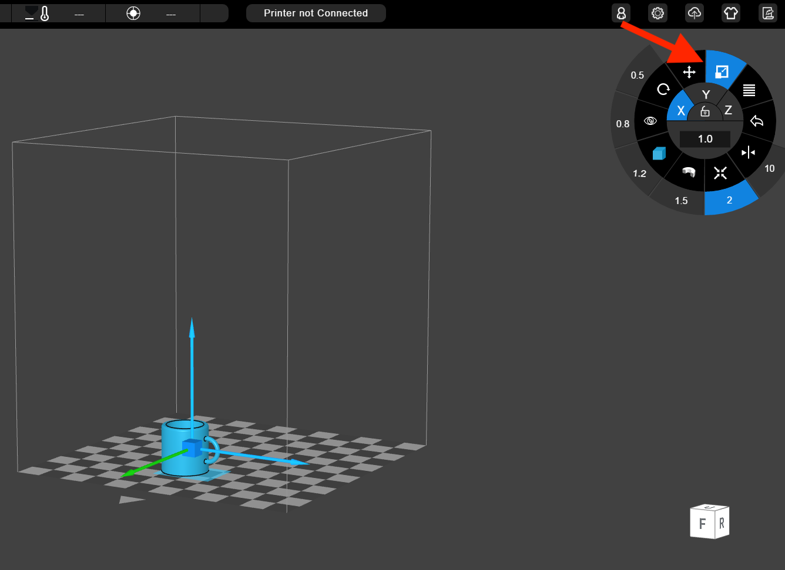

    > モデルの形状に合わせて出力しやすい配置に調整しよう！

  

- プリント設定

      

    - **Layar Thickness** 積層ピッチ - 小さいほど密度が高く、なめらかになります。

    - **Infill** 充填密度 - 目が荒いほど密度が低く、出力時間が短くなります。

    - **Quality** 品質 - 品質が低いほど出力時間が短くなります。
        
    - **No Raft** - ラフトが不要の場合に選択します。(通常は不選択)

        > ラフト : 物体と台を固定するための土台

    - **No Support** - サポーターが不要の場合に選択します。(通常は不選択)

        > サポーター : 空中の物体を支えるための土台

    > 細い・複雑などモデルの形状に合わせて設定しよう！
    
  

- ERROR - このような画面が出た場合は「Yes」を押してください

    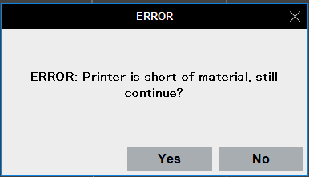