# 基本的な使い方

> 今回は基本的な使い方の説明をしていきます。

## 目次

### 3Dプリンタの使い方

#### 使う際の流れ

- ##### 電源を入れる
3Dプリンタの後ろに正面から見て右下に電源スイッチがあります。
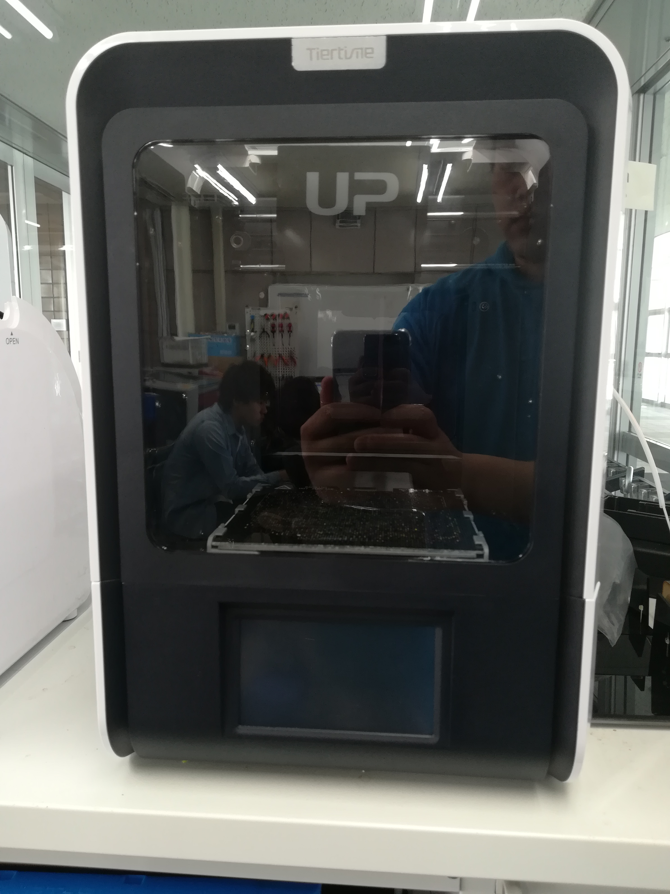
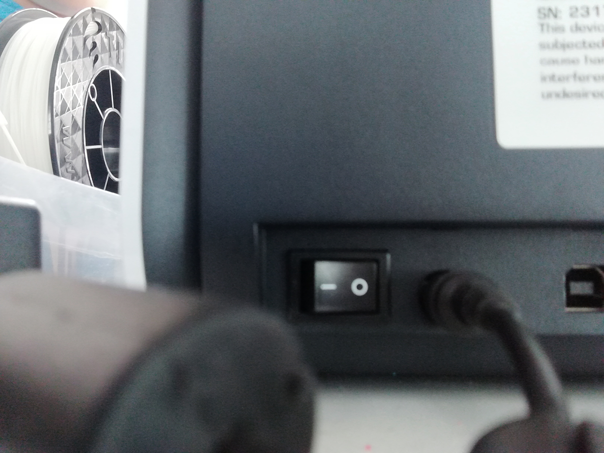

- ##### 初期化する
UPBoxの場合は右にある3つのボタンのうちの左のボタンを長押しします。  
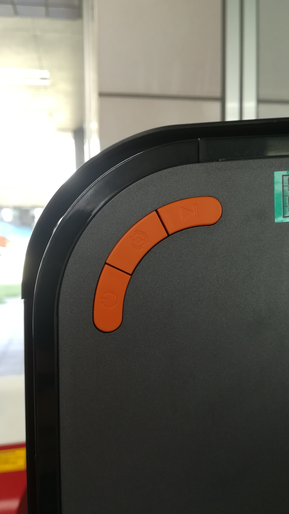

UPminiの場合はディスプレイ右下にある初期化をタッチしてください。  

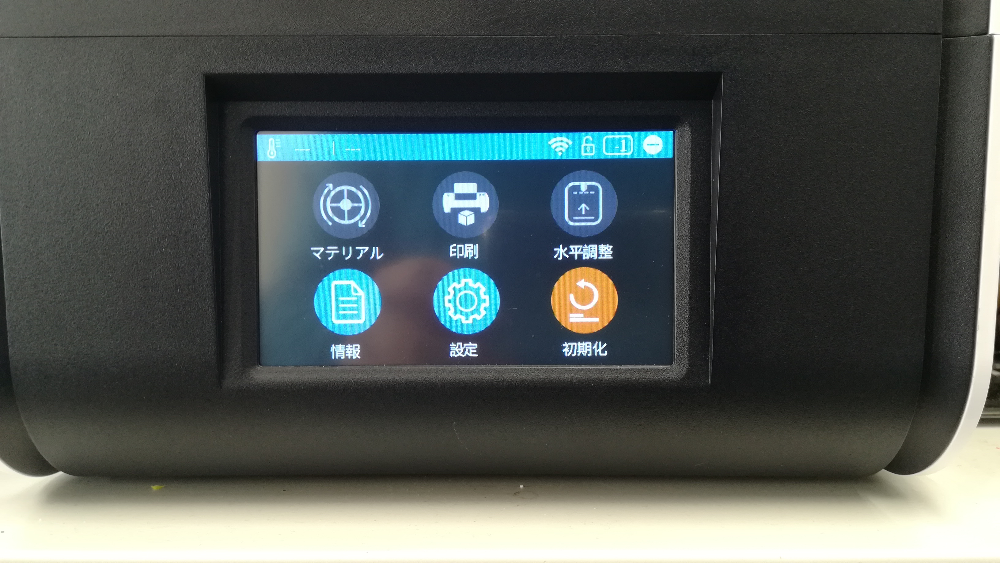

**初期化はコンピュータからも行えます。**

- ##### プレートをセットする
UPBoxの場合は全てのネジとプレートの穴を合わせておいたあと奥に押し込みネジとプレートを引っ掛けます。ネジとプレートが引っ掛かっていないことがありますので浮いている場所がないかを確認してください。  
UPminiの場合は全ての爪に引っ掛かるように横からスライドしてセットしてください。

- **UPBoxの場合**
  
  赤色で囲った部分がきちんとはまっているかを確認してください。一つでも外れていると、きちんとプリントができない場合があります。

- **UPminiの場合**
    
    赤色で囲った部分がきちんとはまっているかを確認してください。

- ##### コンピュータでプリントする
下記パソコンでの操作を参照

- ##### プレートからモデルを剥がし、サポーターを取り除く
ヘラを使いプレートからはがし取ります。その後モデルの形状によってはサポーターと言われる、プリント時に必要になる支えの部分を除去します。 
怪我をしやすい作業です。気をつけて行ってください。

  使用するのはげんのうとヘラです。

  ヘラには表と裏があります
  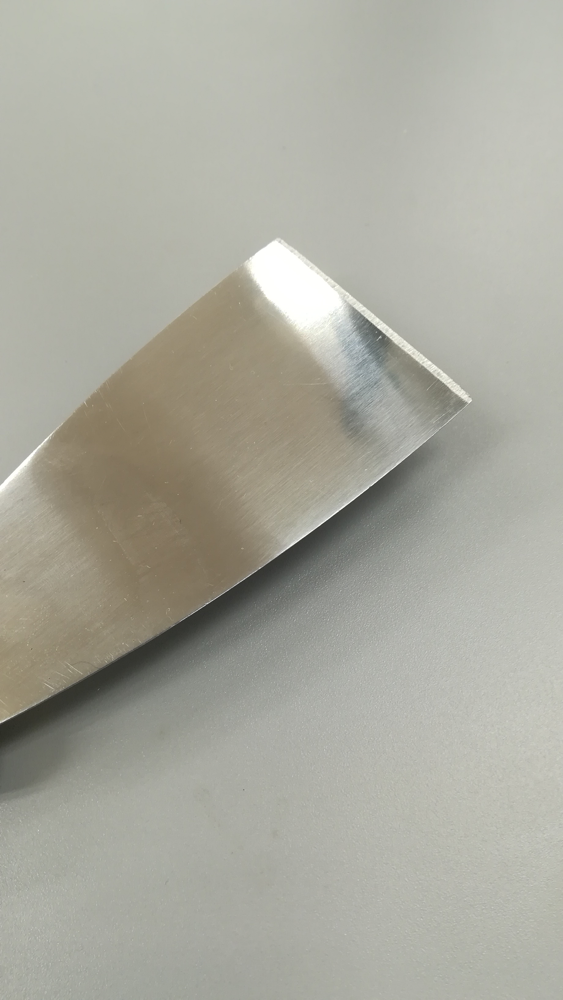
  このように、先端が斜めに切れているのが表面になっています。
  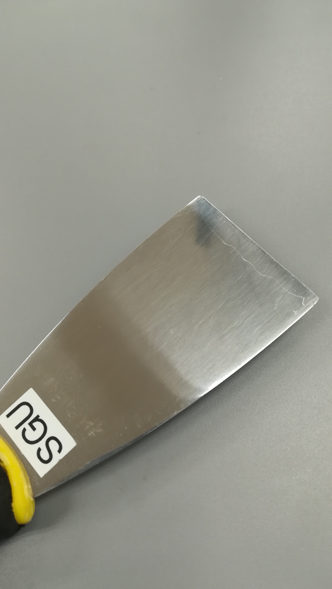
  裏側は何もなく、SGUのシールが貼られています。

  **実際にはがす**
  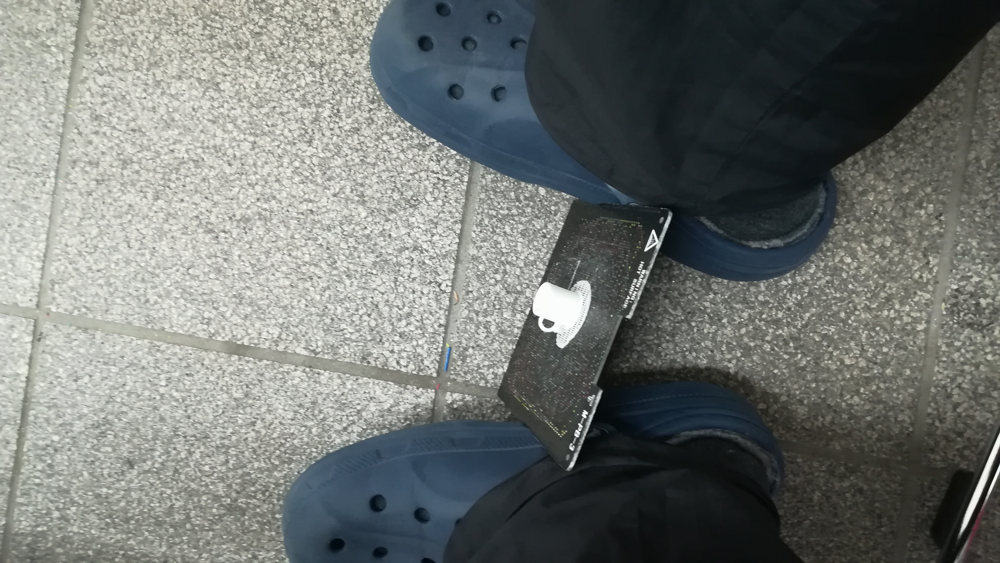
  両足にプレートを挟み、プレートが動かないように固定します。刃先が向かうこともあるので、素肌が露出するような履物はあまりお勧めできません。

  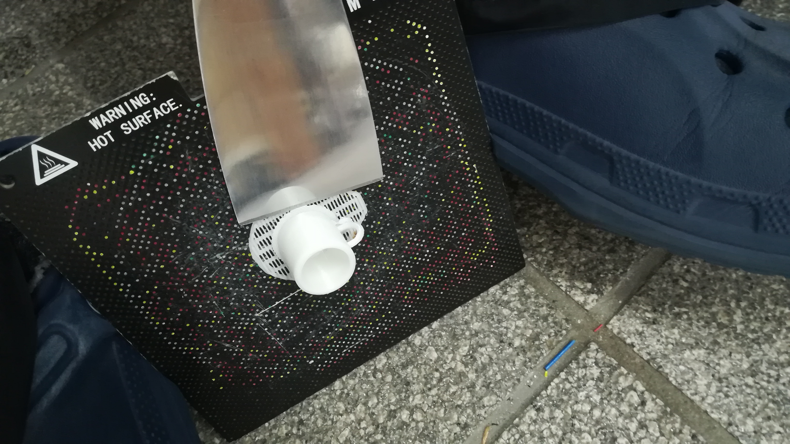
  3Dモデルの端をヘラにあてがいます。この時、上にヘラの表側が来るようにしてください。
  ヘラの尻をげんのうで叩き、はがしていきます。

  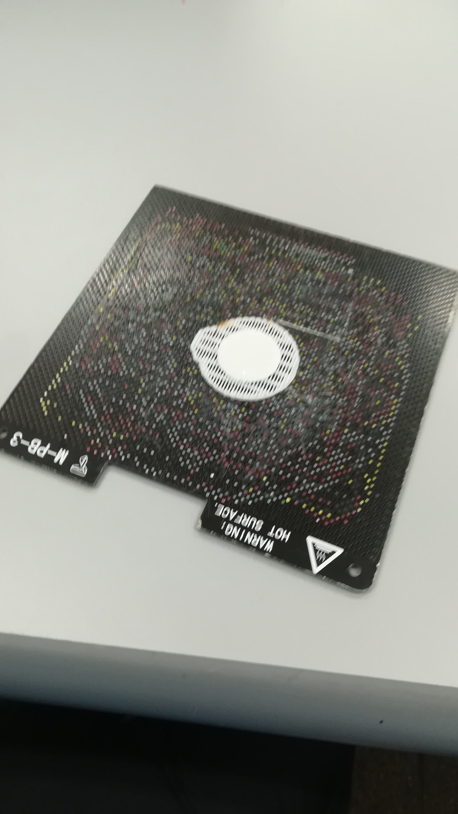
  次回使うためにも、3Dモデルを支えるサポーターもきれいにはがしてください。ヘラで同じようにこそげ落とします。

  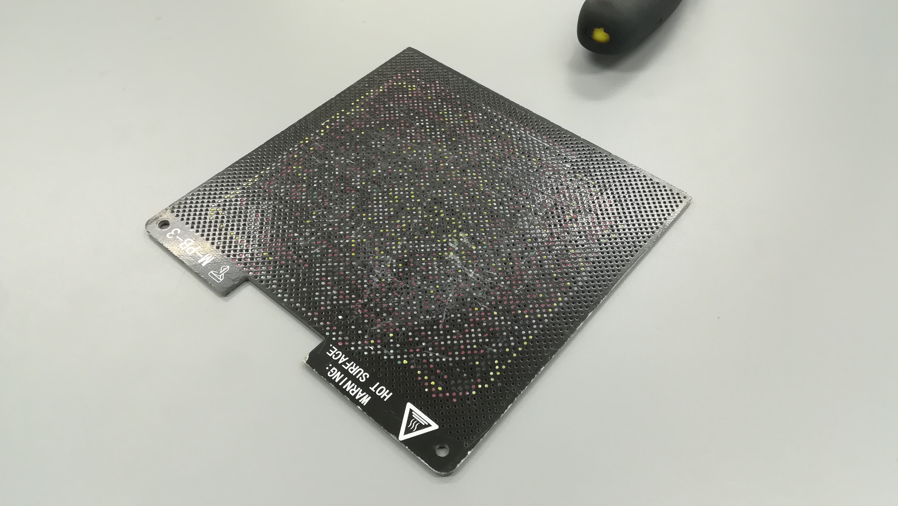
  このようにサポーターなどもすべて落ちるまできれいにして、プリンター内部にセットしてください。

#### 覚えておくといいこと
- マテリアルの除去  
UPBoxの場合は右にある3つのボタンのうちの中央のボタンを2回押します。
UPMiniの場合はディスプレイのマテリアルをタッチしたあと左側の除去ボタン(上矢印)をタッチします。

- マテリアルの挿入  
UPBoxの場合は右にある3つのボタンのうちの中央のボタンを長押しします。
UPMiniの場合はディスプレイのマテリアルをタッチしたあと右側の挿入ボタン(下矢印)をタッチします。

>マテリアルがなくなった、または色を変えたいという時にマテリアルの除去、挿入を行います。

- LED  
UPBoxの場合は右にある3つのボタンのうちの左のボタンを押します。
UPminiはの場合はディスプレイの設定をタッチしたあとライトのボタンでオンオフが切り替えられます。

### パソコンでの操作
> モデリングソフトの使い方は別資料です。

#### 使う際の流れ
- UP Studioを起動
起動直後は以下のような画面が出てきます。
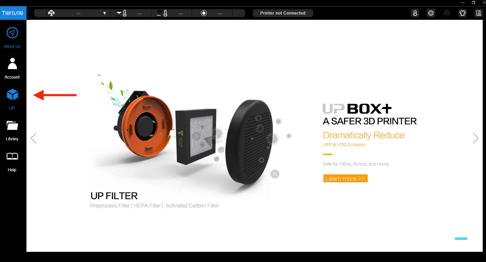
矢印のUPをクリックするとモデルの配置画面が出てきます。
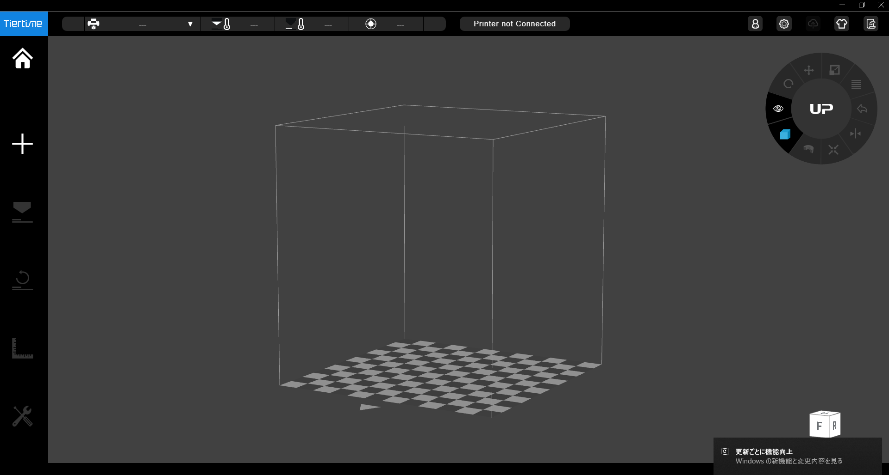

- データを開き、配置
画面左側にある+をクリックし、出てきたメニューの左側のAdd3DModelをクリックします。
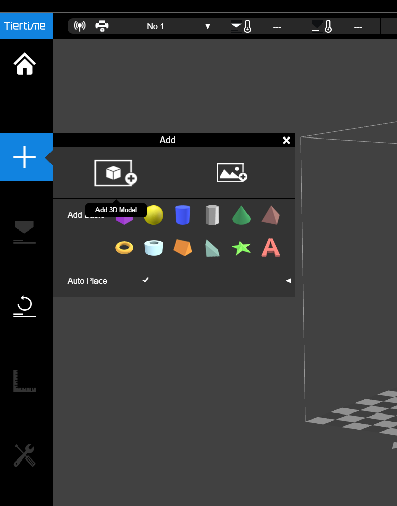

- 使用する3Dプリンタを選択
左上にある歯車をクリックすると設定画面が出てきます。
そこのPrinterをクリックし、使用するプリンタをクリックしてください。
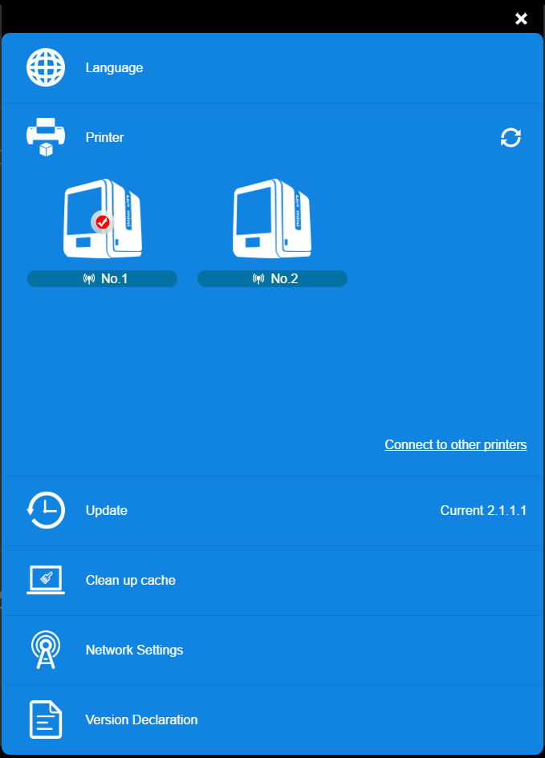
または画面の左上にあるプリンタの選択画面から選択できます
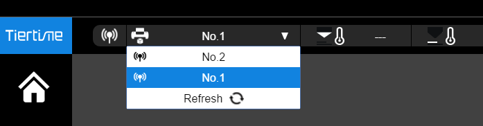

- 初期化
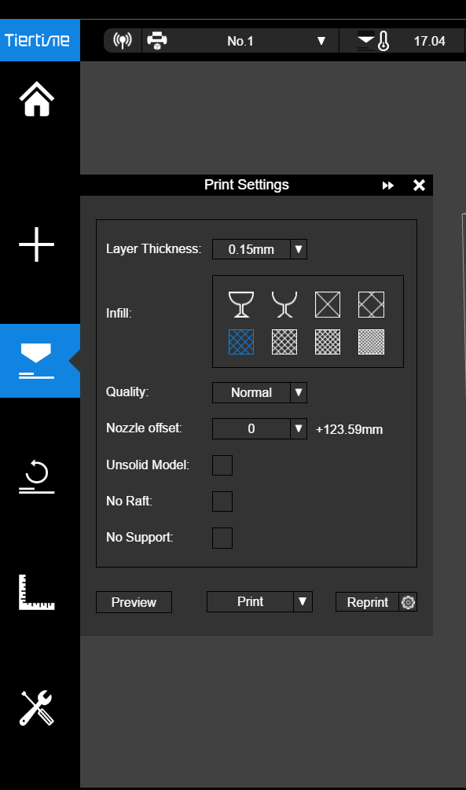

- オプションを設定してスタート

#### 覚えておくといいこと
- 回転

- 複製

- 拡大縮小
