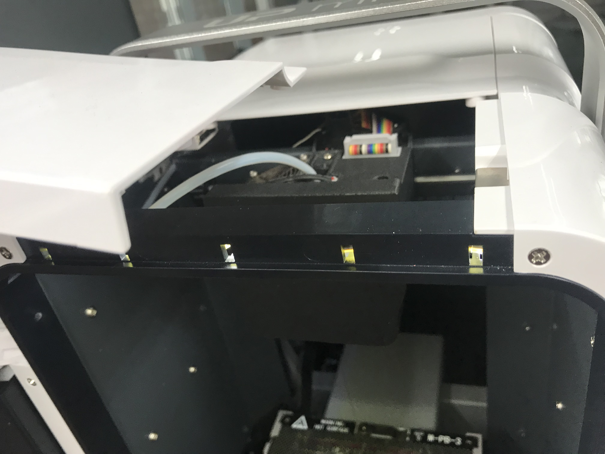
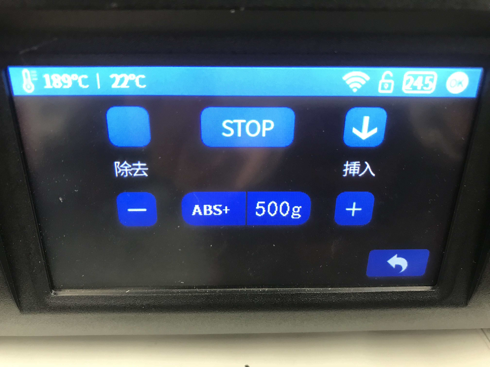
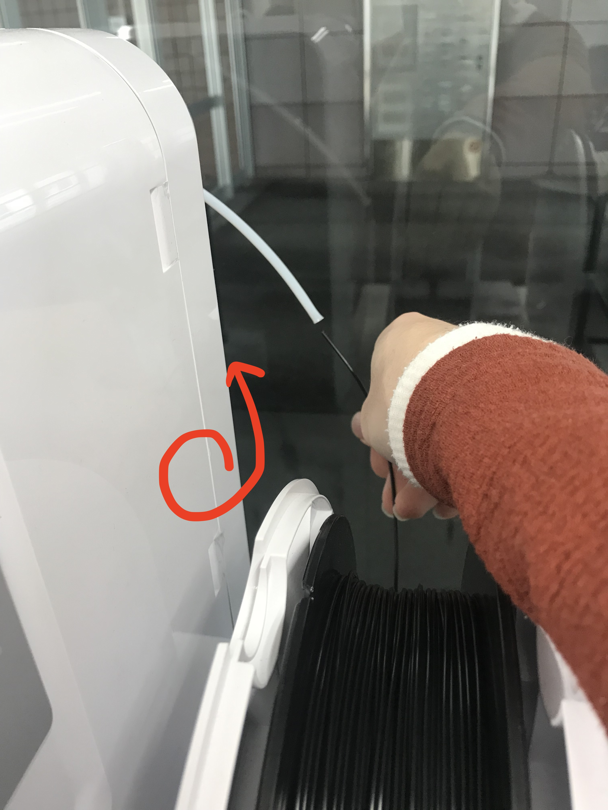
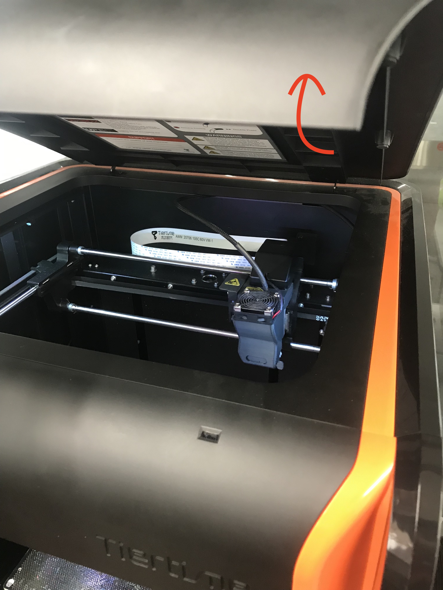
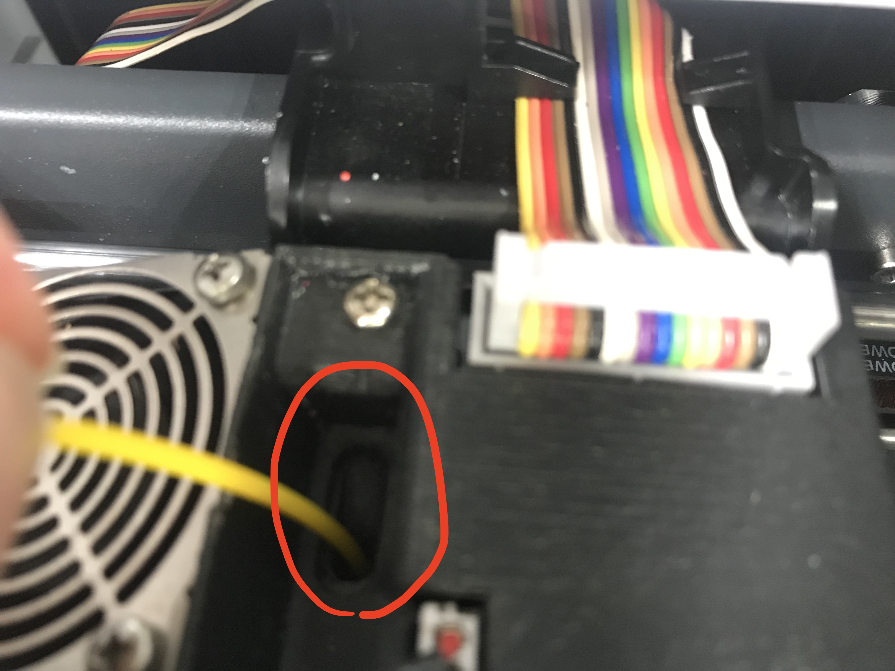
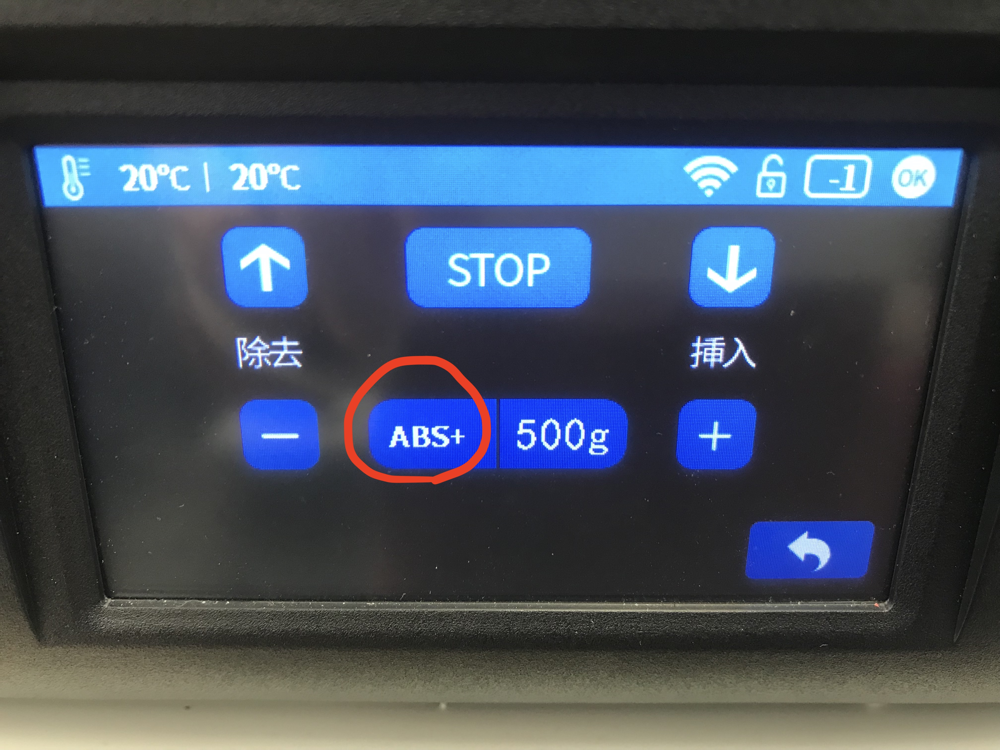
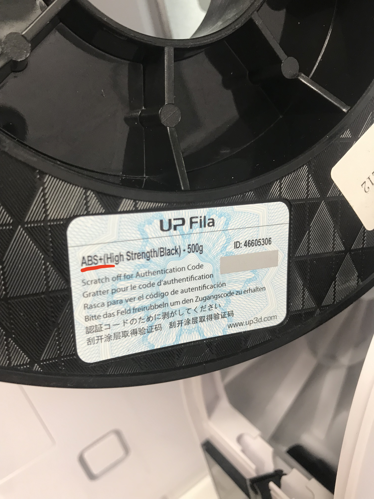
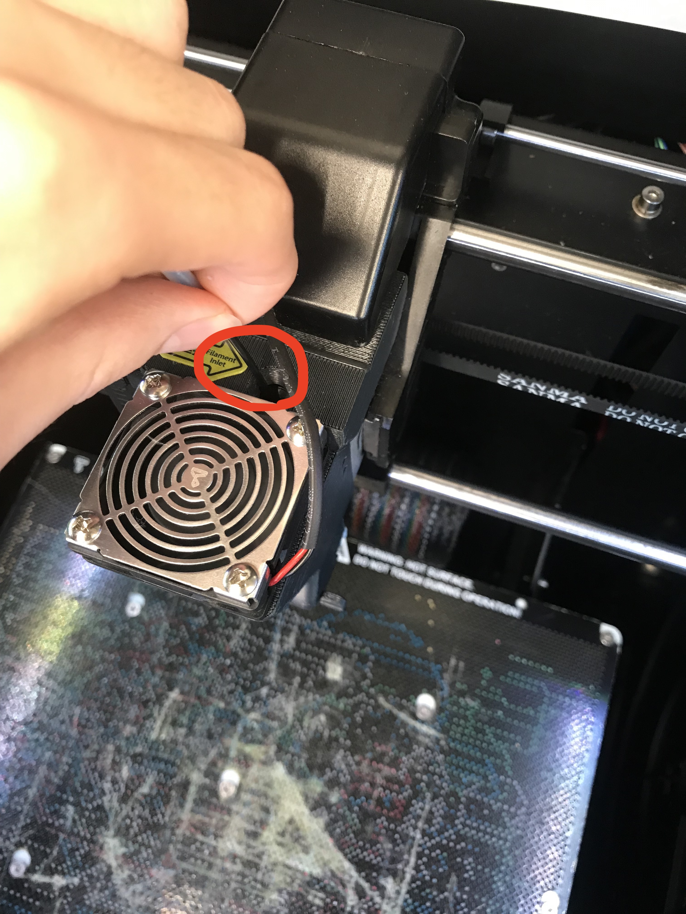
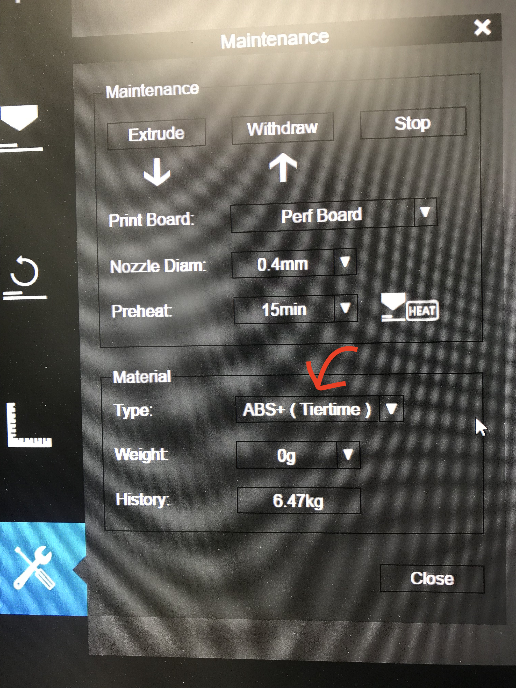

# マテリアルの変え方  

> マテリアルの色、材料を変えたい時の手順について説明します

## 目次  
* マテリアルの取り出し  
  - ###### UP miniの場合（1,2号機の場合）
  - ###### UP boxの場合（3号機の場合）  
* マテリアルの挿入  
  - ###### UP miniの場合（1,2号機の場合）  
  - ###### UP boxの場合（3号機の場合）    

### マテリアルの取り出し

#### UP miniの場合（1,2号機の場合）

- ##### 電源を入れ、初期化する
詳しくはファイル2 参照

- ##### プリンタの頭部分のカバーを外す
軽く押すとカバーが取れます。マテリアルの除去、挿入時は外しましょう。

- ##### モニタのボタンによって取り出し操作を行う
初期化後、マテリアルボタンを押すとこのような画面が現れます。除去ボタンを押してください。  
マテリアルを除去するため、ヘッドの加熱を始めます。取り出しが始まるまで待ちましょう。  

- ##### 除去が始まったら
適温になりますと、ピッと音がなり、除去が始まります。マテリアルが少しずつ上から出てきます。軽くチューブを上に引っ張りましょう。

- ##### ロールを巻き取る
除去が終わりましたら、外のロールを巻き取りロールを外しましょう。これにて除去作業は完了です。  

#### UP boxの場合（3号機の場合）
- ##### 電源を入れ、初期化する
詳しくはファイル2 参照
- ##### プリンタの頭部分のカバーを開ける

- ##### ボタンによって取り出し操作を行います。真ん中のボタンを二回押します。  
マテリアルを除去するため、ヘッドの加熱を始めます。取り出しが始まるまで待ちましょう。  
- ##### 除去が始まったら
適温になりますと、ピッと音がなり、除去が始まります。マテリアルが少しずつ上から出てきます。軽くチューブを上に引っ張りましょう。
- ##### ロールを巻き取る
除去が終わりましたら、外のロールを巻き取りロールを外しましょう。これにて除去作業は完了です。

### マテリアルの挿入
#### UP miniの場合（1,2号機の場合）
- ##### マテリアルの設置
マテリアルのロールをセットし、チューブに挿入します。ロールの向きは下からマテリアルが出るようにしてください。  チューブはヘッドの近くまで続いています。

- ##### マテリアルの先をヘッドの挿入部分で待機させる
ヘッドにはマテリアルが挿入されていく穴があります。マテリアルで穴の中の最深部を探り、そこにマテリアルを当てながら待機させます。

- ##### ボタンによって挿入操作を行う
ディスプレイのマテリアル画面から挿入操作を行います。挿入ボタンを押す前に、挿入するマテリアルの種類が画面に表示されている種類と同じか確認をしてください。

マテリアルの種類はロールにラベリングされています。

ディスプレイに表示されている種類と違う場合はディスプレイの種類のボタンを押すとマテリアルの種類が切り替わります。  
種類の選択を確認しましたら、挿入ボタンを押しましょう。  
マテリアルを当てながら待機しましょう。
- ##### 挿入が始まったら
ピッと音がなりましたら挿入が始まります。マテリアルが中に入っていきますので、始めの2,3秒軽くマテリアルを押して入れ込みましょう。  
自動で入って行きますが、マテリアルが詰まっている場合ガコガコと音がします。そのような不具合が起こった場合はディスプレイのストップボタンを押して中止しましょう。その際はSAに状況を伝えて、つまりを直してもらってください。
- ##### 挿入が終わったら
ピッと音と共に挿入が完了します。ヘッドの先端から排出されたマテリアルが出てきている場合があるので、除去しましょう。

#### UP boxの場合（3号機の場合）
- ##### マテリアルの設置
マテリアルのロールをセットし、チューブに挿入します。ロールの向きは下からマテリアルが出るようにしてください。  チューブはヘッドの近くまで続いています。

- ##### マテリアルの先をヘッドの挿入部分で待機させる
ヘッドにはマテリアルが挿入されていく穴があります。マテリアルで穴の中の最深部を探り、そこにマテリアルを当てながら待機させます。

- ##### ボタンによって挿入操作を行う
マテリアルの挿入操作を行います。挿入操作をする前に、挿入するマテリアルの種類が、設定されているマテリアルと同じかどうかを確認します。PCからMaintainance -> MAterial -> Type に表示されている種類を確認してください。

マテリアルの種類はロールにラベリングされています。

種類と違う場合は、設定の種類を選択し直してください。  
種類の選択を確認しましたら、挿入操作を行いましょう。  
真ん中のボタンを長押しすると挿入のための加熱が始まります。マテリアルを当てながら待機しましょう。
- ##### 挿入が始まったら
ピッと音がなりましたら挿入が始まります。マテリアルが中に入っていきますので、始めの2,3秒軽くマテリアルを押して入れ込みましょう。  
自動で入って行きますが、マテリアルが詰まっている場合ガコガコと音がします。そのような不具合が起こった場合はディスプレイのストップボタンを押して中止しましょう。その際はSAに状況を伝えて、つまりを直してもらってください。
- ##### 挿入が終わったら
ピッと音と共に挿入が完了します。ヘッドの先端から排出されたマテリアルが出てきている場合があるので、除去しましょう。

