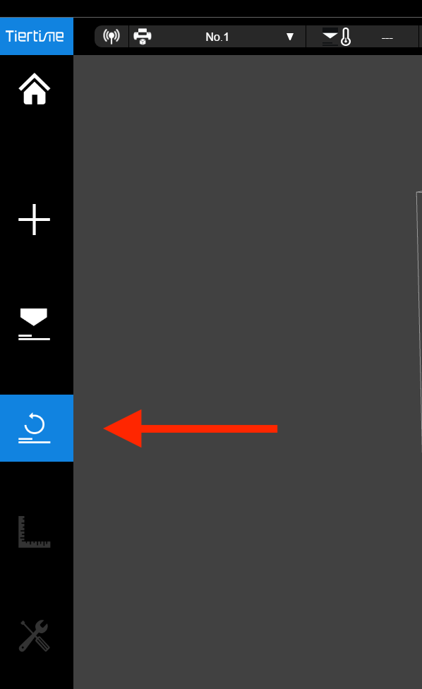
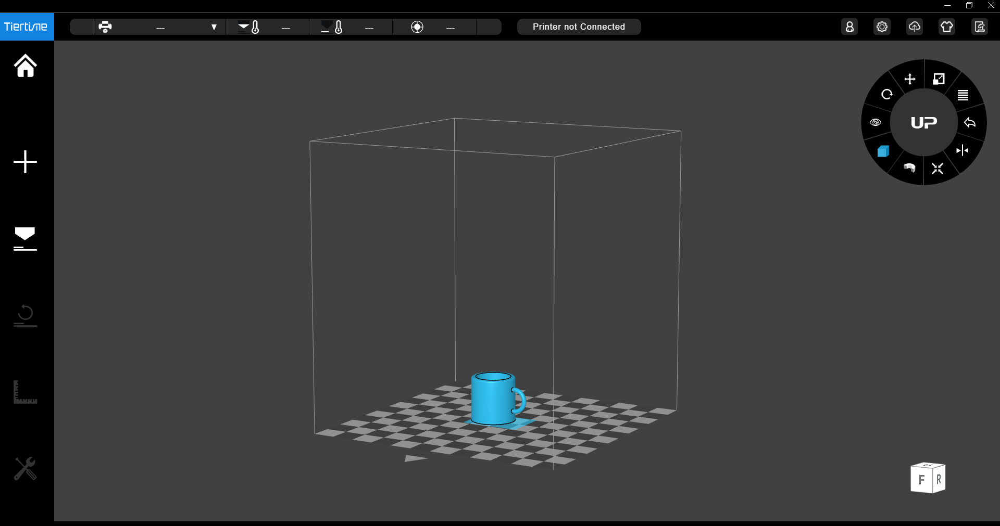
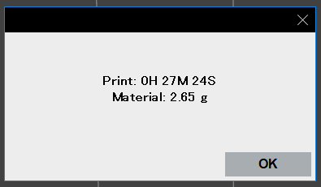
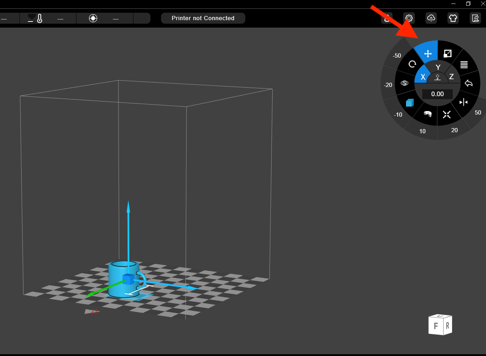
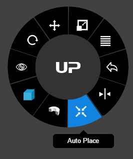
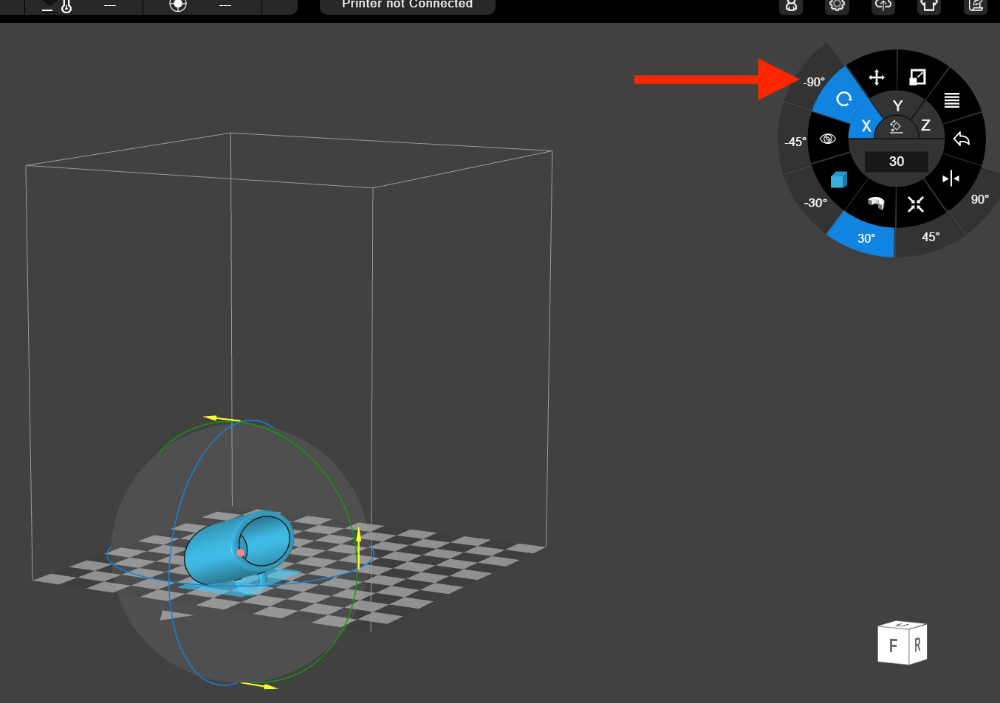
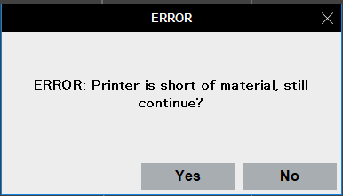

# Aizu Geek Dojo 講習 (3Dプリンタ④)

## 目次

- アプリの操作方法
- 覚えておくといいこと

### アプリの操作方法

#### 1. UP Studioを起動
アイコンをクリック

起動直後は下のようなホーム画面が出てきます。

画面左側にある「UP」ボタンをクリックし、モデルの配置画面に切り替えます。

#### 2. 3Dプリンタを選択
右上にある歯車をクリックすると設定画面が開きます。

「Printer」をクリックし、使用するプリンタを選択してください。

または画面左上のバーからも同様に選択できます。

#### 3. 初期化
まず出力する前に、画面左側の「↪」ボタンをクリックしてプリンターを初期化します。

またはプリンター本体の操作でも同様に初期化できます。
- UPminiの場合 - 画面で右下の「初期化」→「✔︎」を選択

- UPBoxの場合 - 右にある3つのボタンのうちの左のボタンを長押し

右上のステータスバーに「Printer Ready」が表示されたら完了。

#### 4. データを配置
画面左側にある「+」ボタンを選択し、出てきたメニューの左側の「Add 3D Model」をクリックします。

ファイルを選択すると、中央のモデル配置画面に3Dモデルが表示されます。

右上のツールで配置などを調整します。(参照：覚えておくといいこと)

#### 5. オプションを設定して出力

画面左側の「Print」ボタンで設定画面を開きます。

必要なオプションを設定します。(参照：覚えておくといいこと)

右下の「Preview」で出力時間・マテリアルの量を確認。

マテリアルの残量が足りるか確認したらいざ、出力。
「Print」ボタンでスタートします。

### 覚えておくといいこと

- 配置の調整方法 - 右上のツールを使います。

    - 位置

    十字ボタンで移動できます。

    

    または「Auto Place」を押すと、自動的に位置調整をしてくれます。

    

    - 回転

    

    - 大きさ

    

- ERROR

    このような画面が出る場合があります。そのときは「Yes」を押してください。

    