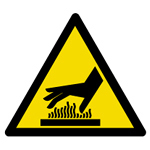
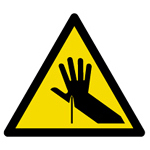

# Aizu Geek Dojo 講習 (3Dプリンタ はじめに)
 
## 目次

- 1.	3Dプリンタについて
- 2.	安全に操作するために
- 3.	操作方法

### 1. 3Dプリンタについて

#### 3Dプリンタとは
3Dプリンタはコンピュータなどで作成した立体的なモデルのデータを実際の物に出力する機械です。

##### AizuGeekDojoにある3Dプリンタ
Aizu Geek Dojoには3台の3Dプリンタがあります。
- Guider Ⅱ
    最大加工寸法 ?W x ?D x ?H mm
- Adventurer 3 (2台)
    最大加工寸法 150W x 150D x 150H mm

どちらもABS樹脂もしくはPLA樹脂を溶かし下から重ねていくことで立体的な形にしていきます。

##### 3Dプリンタの危険性
3Dプリンタは比較的簡単かつ安全に使用することができますが、気をつけて使用しないと怪我や思わぬ事故が発生する可能性があります。必ず「2. 安全に操作するために」を参照してください。  
 
### 2. 安全に操作するために
3Dプリンタではプリントした物を取り出す際にヘラを使います。その際気をつけて作業しないと手を切る可能性があります。
使用する際はヘラの先に手を置かないようにし、十分に注意して作業してください。

またAizuGeekDojoにある3Dプリンタは樹脂を熱で溶かして加工しています。そのためプリント中は3Dプリンタの中に手を入れたり、プリント直後にノズルに触れたりしないでください。

### 3.注意 危険性
| Mark |  |  |
|:-----------:|:------------:|:------------:|
| 内容 | 高温、火傷に注意 | 手のケガに注意 |

3Dプリンターは出力の際に高温になります。プリントが終わってすぐに触れると、高温のためにやけどを負う可能性があります。十分に冷めたことを確認してから触るなど、細心の注意を払って使用してください。

出力されたモデルをはがすときには鋭利な刃物を使用します。ケガをしやすいため、けがをしないよう十分注意をしてください。
