# Aizu Geek Dojo 講習 (3Dプリンタ FlashPrintの使い方)
 
## 目次

- 1.	[FlashPrintの概要](#1FlashPrintの概要)
- 2.	[ダウンロード](#2ダウンロード)
- 3.	[操作方法](#3操作方法)

### 1.FlashPrintの概要
FlasPrintはFLASHFORGE社が独自に開発したソフトウェアです。
無料で利用することができます。

##### FlashPrintは何をするものなのか
全ての3Dプリンターには**スライサー**と呼ばれるソフトウェアがないとプリントはできません。

スライサーはCADソフトまたは3DCGソフトなどで作られた三次元データーを医療ＭＲＩのように断面切断して、3Dプリンター本体が読み取れる命令文**G-code**を作成します。

3DプリンターはG-codeの断層の形を基準に樹脂を溶かして塗り埋めて、一層目が終わるとその上にまた塗り重ねることで徐々に立体物になっていきます。

3Dデータ → G-code → 印刷
3DデータからG-codeへの変換をしてくれるのがFlashPrintです[^1]。
ちなみに、G-codeを3DPrinterへ送れば印刷してくれます。

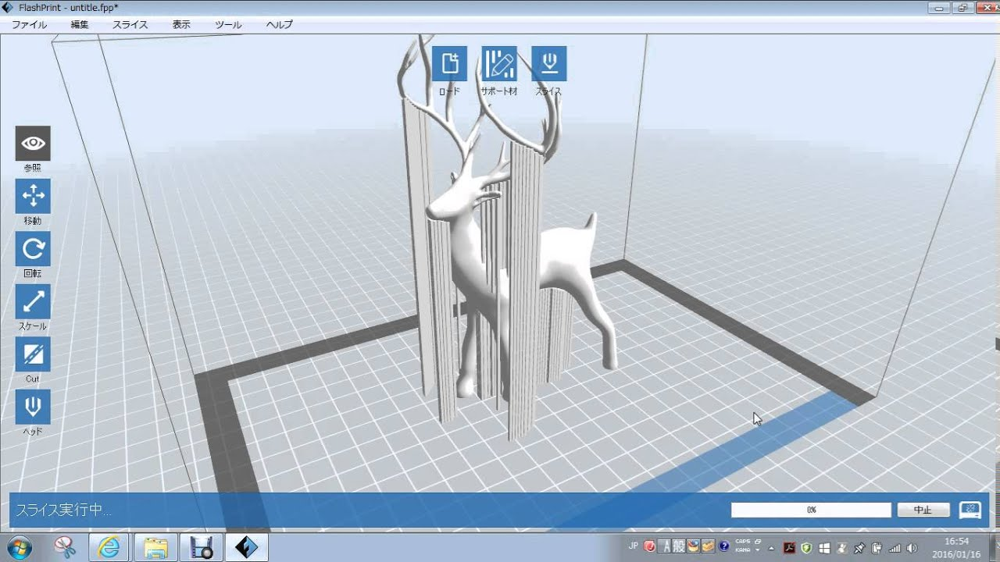

### 2.ダウンロード
製品ホームページのサポートから入手できます。
[http://flashforge.co.jp/support/](http://flashforge.co.jp/support/)
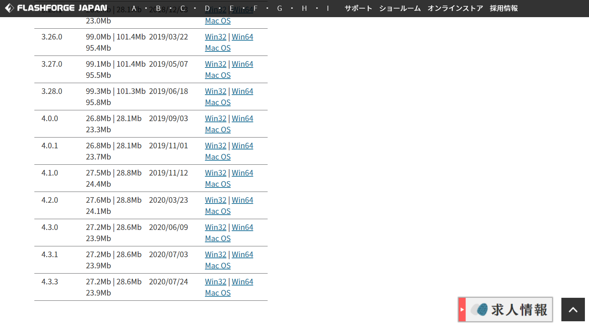

私の環境がWindowsなので、MacOSではどのようにするか分かりませんでした。m(_ _)m　ですので、以下に記すダウンロード方法はWindows用です。ただ、恐らくMacOSでも同じようなものではないかと思っています。

先ほどのホームページからWin64もしくはWin32と書かれているところからzipファイルをダウンロードします。バージョンは好きなものをダウンロードしましょう。私は今回4.3.3をダウンロードします。

##### 環境の確認
自分のパソコンが32ビットか64ビットなのかわからないという方は、「Windowsの設定」→「システム」→「バージョン情報」次の画像のようにで確認することができます。

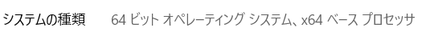

##### インストーラーを起動
ダウンロードしたら以下のようなzipファイルがダウンロードできていると思います。

zipファイルの中身にはインストーラーであるexeファイルがあると思うのでそれを実行します。

 

すると言語の選択画面が出てくるので日本語を選択します。
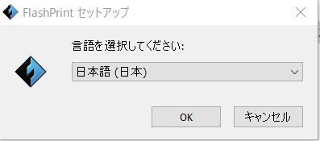

 

セットアップウィザードが開きました。「次へ]をクリックします。
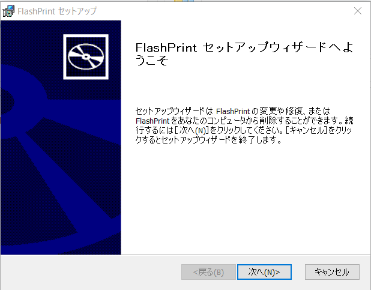

 

同意して「次へ」をクリックします。
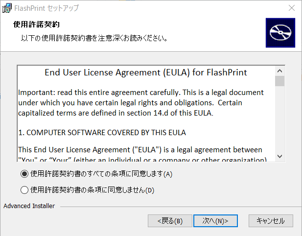

 

インストールするフォルダが決まったら「次へ」をクリックします。
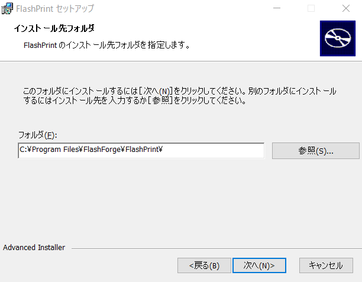

 

「インストール」をクリックします。クリックした際、このファイルを許可しますか？という内容でWindows側から確認がありますが、許可してください。また、環境によってはデバイスドライバについてのセットアップウィザードが起動することもありますが、それらも順次確認しながら進めてください。
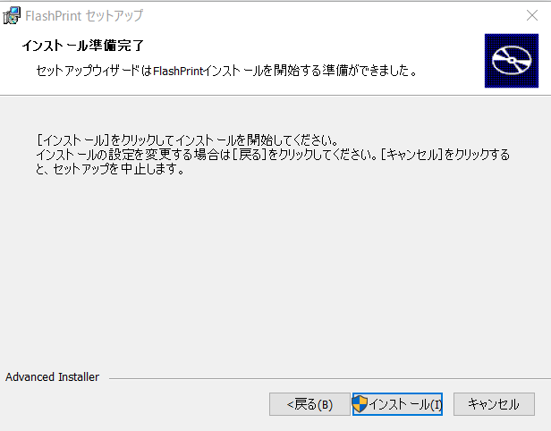

 

これでインストールが完了しました。
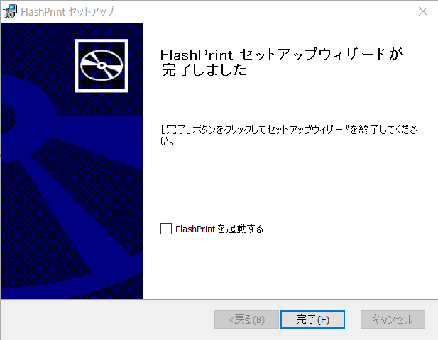

   

### 3.操作方法

 

##### FlashPrintを起動
実際にFlashPrintを起動して簡単な3Dモデルを読み込んでみましょう
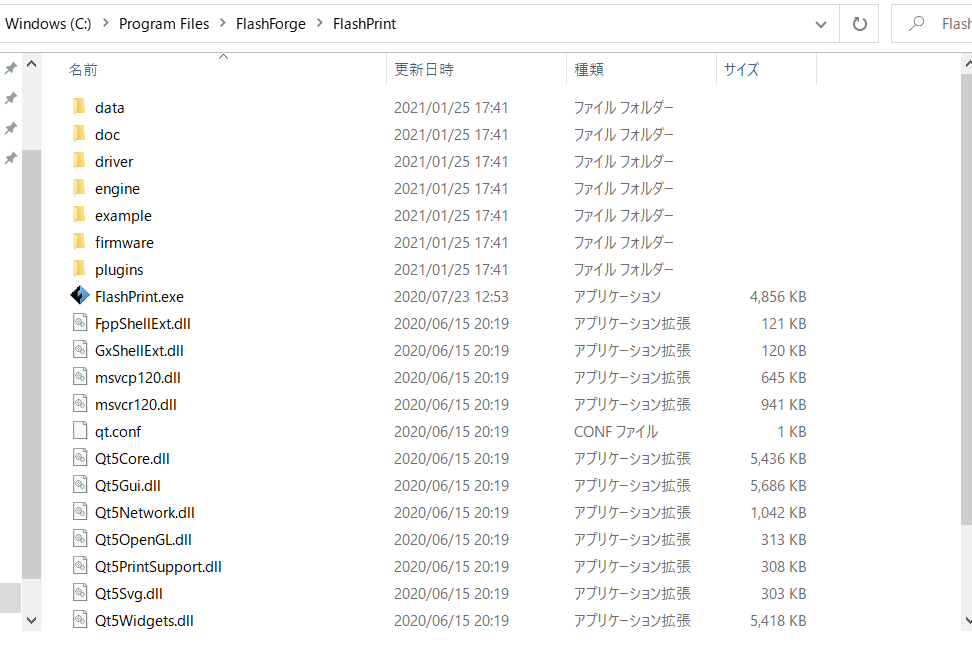

 

##### 3Dモデルをダウンロード

ではまず、下の3Dモデルをダウンロードしてください。[^2]
[デザインチェア](../3Dmodel/DesignChair.stl)

 

##### 3Dモデルの読み込み

ダウンロードできたら、FlashPrintのロードというアイコンをクリックして3Dモデルを読み込みましょう。
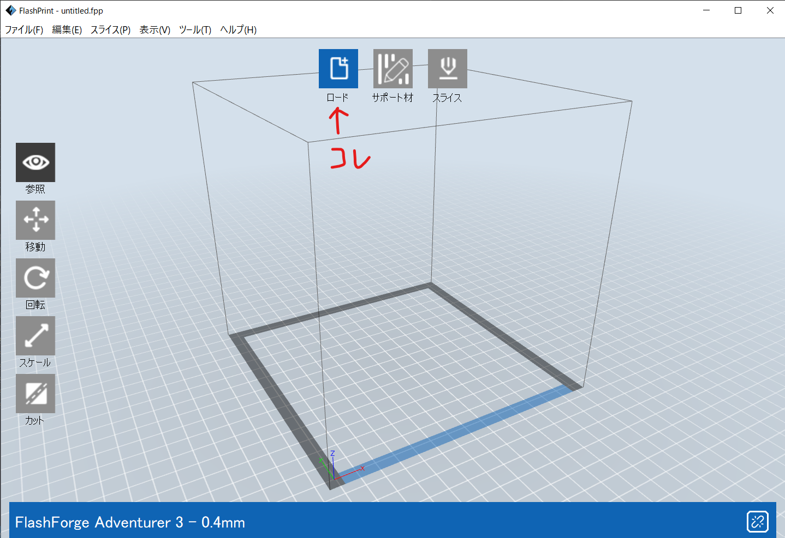

 

小さいですが、3Dモデルを読み込ことができたと思います。マウスのスクロールで視点をズームさせることができ、右クリックを押しながらマウスを動かすと視点を自由に回転させることができます。
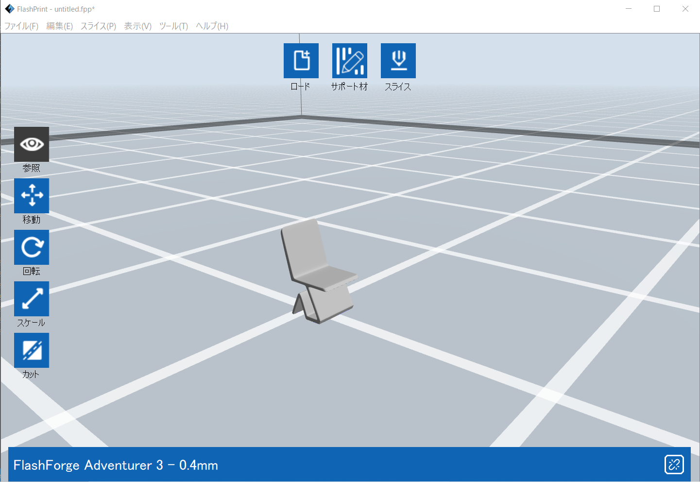

 

モデルを選択したあと左のアイコンのどれかを2回クリックすることで、対象のモデルに対するアイコンの機能を見られます。色んな機能を試してみてください。ちなみに、画像にある「<u>ベッドに置く</u>」機能はZ座標を0にするものです。
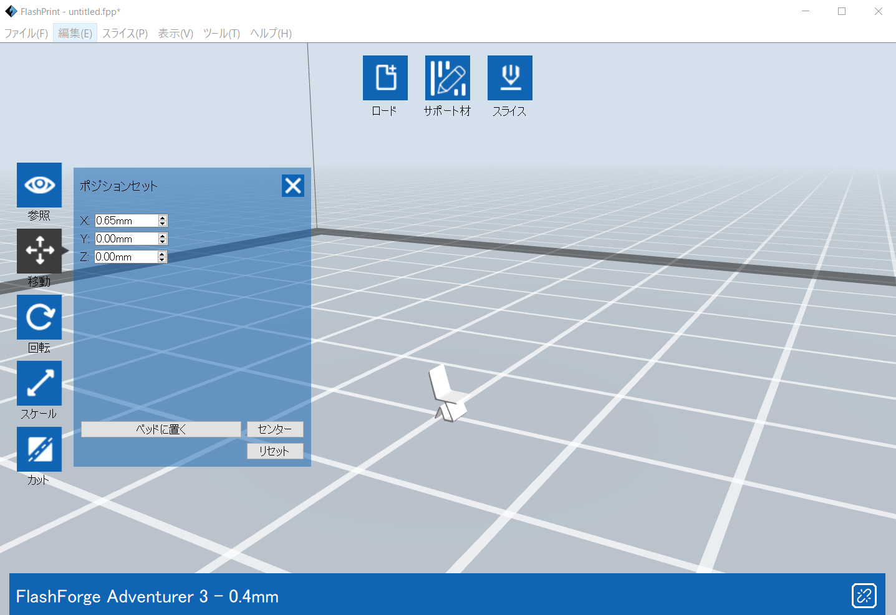

 

##### サポート材

次に、3Dモデルにサポート材を付けます。サポート材とは3Dモデルに、宙に浮いているパーツがあるときでもミスが起こらないように加える部分です。3Dモデルを印刷したときにプリンタから傷つけずに剝がすのが難しいので、宙に浮かせて印刷することがよくあります。下の画像ではスケールを500%、移動で各座標(x,y,z)を(0,0,10mm)にしました。
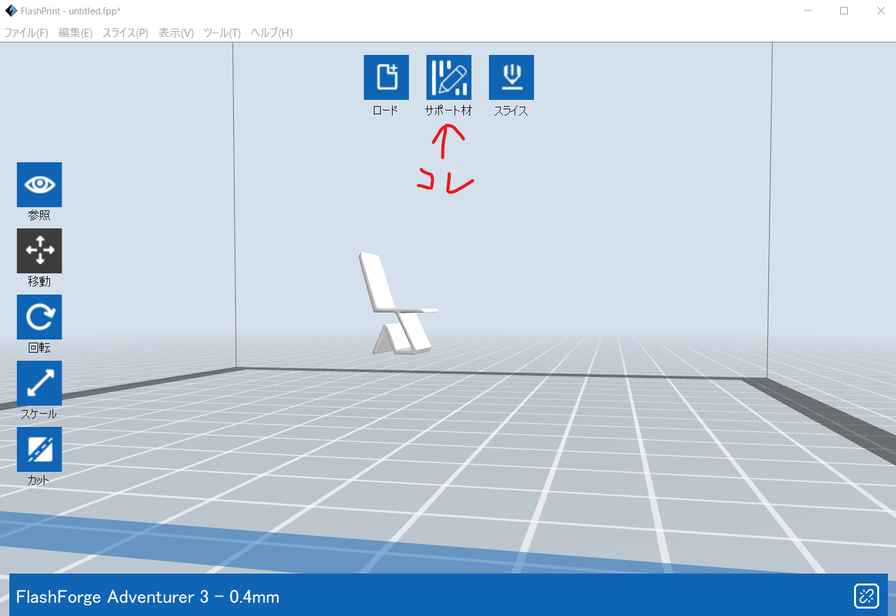

 
先ほどの画面からサポート材をクリックすると次のような画面になります。

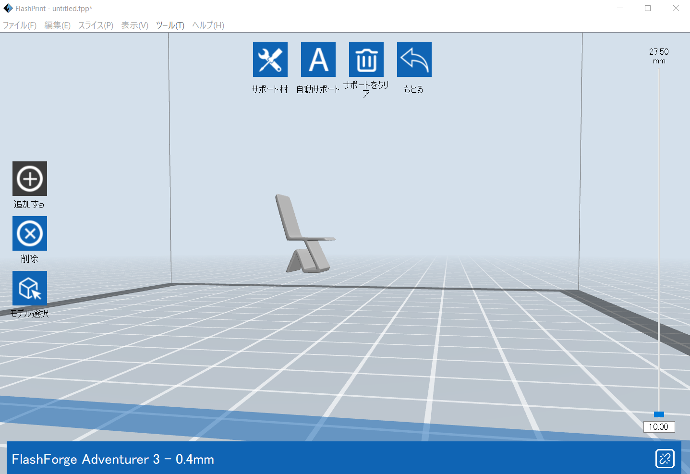

この画面の説明をしていきます。
- サポート材
  - 枝形とライン形
    - 枝形:不規則なモデル面をサポートするのに適しており、フィラメント消費が少ないです。
    - ライン形:フラットなモデル面をサポートするのに適しており、フィラメント消費が多いです。枝形に比べてモデル表面の造形精度が優れています。
  - オーバーハングスレッシュ
    - オーバーハング(overhang)スレッシュ(thresh)、つまり勾配のしきい値を表しています。この項目により、3Dモデルのどれくらいの勾配の部分にサポート材をつけるかを設定できます。角度を大きくするほどサポート材は少なくなります。
  - ポスト直径(枝形のみ)
    - サポート材の直径の太さの設定です。
  - ベース直径(枝形のみ)
    - プラットフォームに接触するサポート材ベースの直径の太さの設定です。
  - ベースの高さ(枝形のみ)
    - プラットフォームに接触するサポート材ベースの高さの設定です。
  - 円柱直径(ライン形のみ)
    - サポート材の円柱の太さの設定です。
  - プレートと接触する
    - チェックを入れると自動サポートの際に、プラットフォームからのみサポート材が形成されます。例えば、内部が空洞のモデルを出力する際には内部にサポート材が形成されなくなります。

- 自動サポート
  - 自動サポートをクリックすると、モデルに対してサポート材が必要な位置を計算しサポート材を自動生成します。

- サポートをクリア
  - サポートをクリアをクリアすると、選択しているモデルに追加されたすべてのサポート材が削除されます。

- 追加する
  - サポート材の追加作業が可能になります。
  始点を左クリックで決定して、クリックしたままの状態ですスライドして終点(プラットフォーム上)でマウスを話すと、新たなサポート材が生成されます。
  **※サポート材が必要でないところだったり、サポート材の角度が大きすぎてプラットフォーム上に達してなかったりすると、赤く表示されてサポート追加が失敗します。**

- 削除
  - サポート材の削除作業が可能になります。
  削除するサポート材にマウスカーソルを重ねると、水色に表示されます。
  その状態でサポート材をクリックして選択すると、選択されたサポート材は削除されます。

 

##### スライス

では、サポート材をつけたところでスライスしてみましょう。スライスは上のほうで記述したとおり、印刷用の形式であるG-codeに変換するものです。スライスアイコンをクリックすると次のような画面になります。

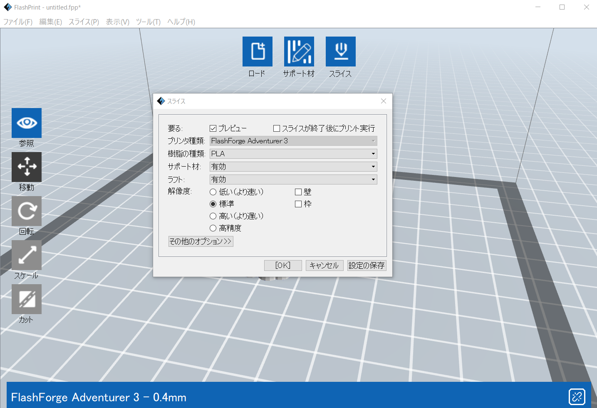

これらの項目で詳しい印刷時の設定を行うことができます。
- プレビュー
  - スライス終了後、プレビュー画面を表示するかを選択します。
- スライスが終了後にプリント実行
  - スライス終了後、自動でプリントを実行するかを選択します。
- 樹脂の種類
  - 使用するフィラメントの種類を選択します。
- サポート材
  - サポート材を有効にするか無効にするかを選択します。
- ラフト
  - ラフトとは、モデルの下にプリントされる厚さ約0.5mmの樹脂版です。樹脂の反りを防ぐためにつけるかどうかを決められます。
- 解像度
  - モデルを印刷する精度を選択します。
- 壁
  - 二色プリントで左右ヘッドから押し出されるフィラメントカラーが混じったりするトラブルを回避できます。
- 枠
  - モデル底面の輪郭を拡張して枠を印刷するか選択します。
- その他のオプション
  - レイヤーの高さ
    - レイヤーの高さ
      - モデルのレイヤー1層ごとの高さを設定できます。数値が小さいほど精度が上がりますが、印刷時間は長くなります。
    - 第一層目のレイヤー
      - モデルの第一層目の厚さを設定できます。第一層目の厚さはプラットフォームとの密着性に関係しています。
  - 外枠
    - 外枠レイヤ数
      - モデルの外周層のレイヤー数を設定できます。
    - 頭部レイヤ数
      - モデルの頭部層のレイヤー数を設定できます。
    - 底面レイヤ数
      - モデルの底面層のレイヤー数を設定できます。
  - 充填率
    - 充填率
      - 内部を何%充填させるかを設定できます。
    - モデル内部充填パターン
      - モデル内部を充填させる際の形状を選択します。
    - 充填をコンバイン
      - レイヤーの高さ設定に従ってコンバインのレイヤー数が選択可能です。印刷時間を短くできます。
  - スピード
    - プリント速度
      - 印刷中のヘッドの移動スピードです。
    - ヘッド移動速度
      - 印刷していないときのヘッドの移動スピードです。
  - 温度
    - 印刷中のノズル温度です。
  - プラットフォーム
    - 印刷中のプラットフォームの温度です。推奨されている温度は以下の表のようになっています。

    | 部品\樹脂          | PLA        | ABS        |
    |:-:                 |:-:       |:-:          |
    | ノズル             | 210~220℃  | 220~235℃  |
    | プラットフォーム    | 30~50℃    | 80~100℃   |

 

スライスの設定が終わったらOKをクリックして.gx形式のファイルを保存しましょう。保存すると自動で.gx形式のファイルを開いてくれます。

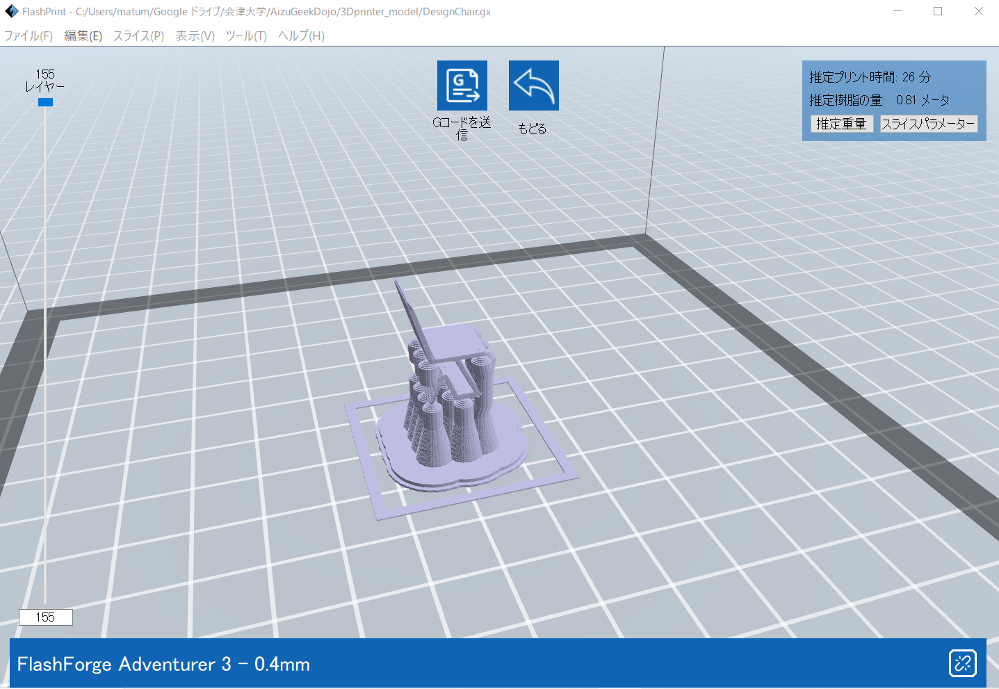

 

##### Gコードの送信

Gコードを送信アイコンをクリックして、使用するプリンターを選びましょう。既に使っているプリンターには **(占用済)** という確認も出ます。プリンターに接続するにはAizuGeekDojoWifiに接続する必要があるので、事前に接続しておきましょう。
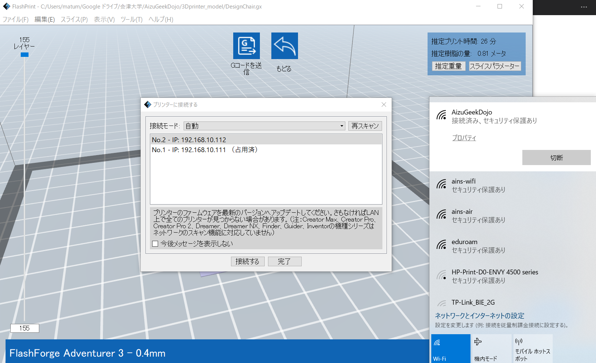

 

[^1]:FlashPrintで対応できるファイル形式のものに限ります。.stlなど。その他の形式の3Dデータを変換するにはFusion3Dかコンバーターを使いましょう
[^2]:この3Dモデルはフリーダウンロードサイトからダウンロードしてきたものです。