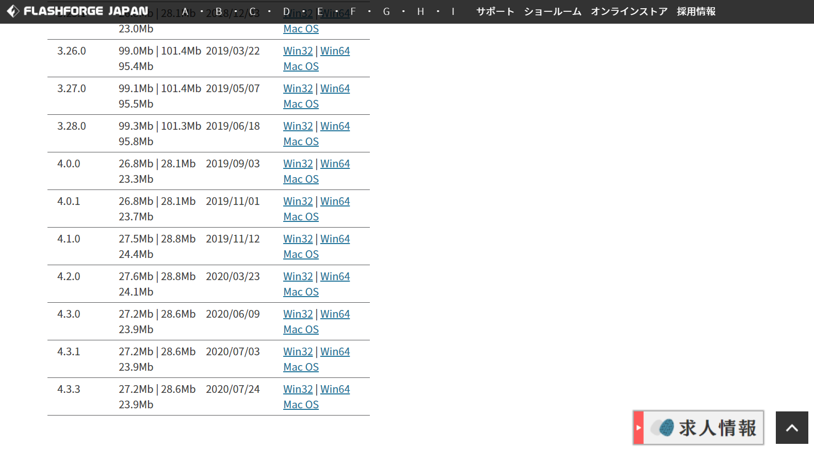
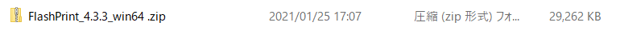
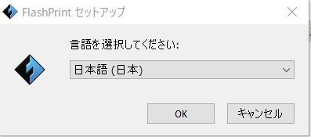
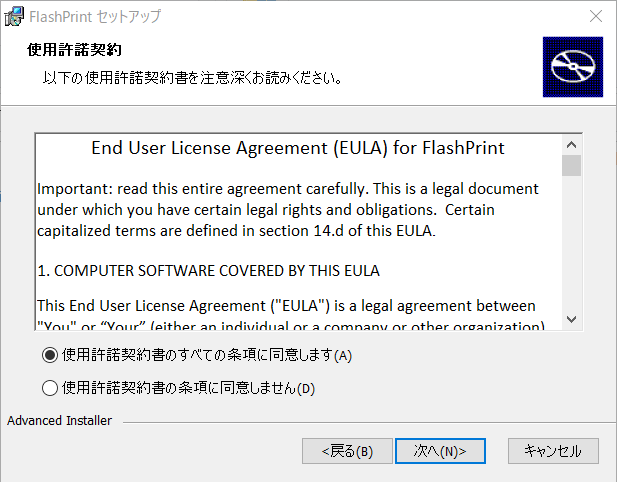
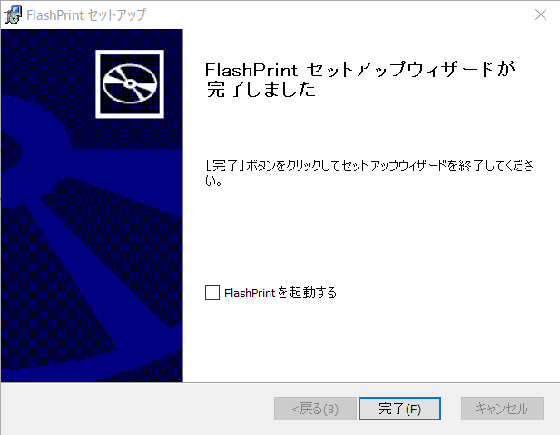
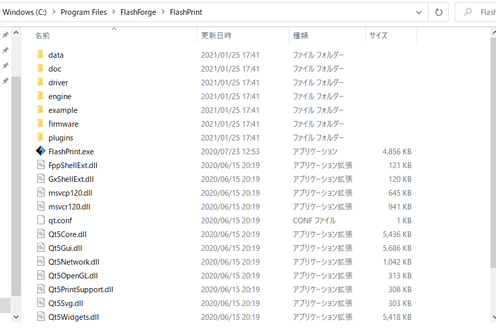

# Aizu Geek Dojo 講習 (3Dプリンタ データの作成)
 
## 目次

- 1.	[FlashPrintの概要](#1FlashPrintの概要)
- 2.	[ダウンロード](#2ダウンロード)
- 3.	[操作方法](#3操作方法)

### 1.FlashPrintの概要
FlasPrintはFLASHFORGE社が独自に開発したソフトウェアです。
無料で利用することができます。

##### FlashPrintは何をするものなのか
全ての3Dプリンターには**スライサー**と呼ばれるソフトウェアがないとプリントはできません。

スライサーはCADソフトまたは3DCGソフトなどで作られた三次元データーを医療ＭＲＩのように断面切断して、3Dプリンター本体が読み取れる命令文**G-code**を作成します。

3DプリンターはG-codeの断層の形を基準に樹脂を溶かして塗り埋めて、一層目が終わるとその上にまた塗り重ねることで徐々に立体物になっていきます。

3Dデータ → G-code → 印刷
3DデータからG-codeへの変換をしてくれるのがFlashPrintです[^1]。
ちなみに、G-codeを3DPrinterへ送れば印刷してくれます。

### 2.ダウンロード
製品ホームページのサポートから入手できます。
[http://flashforge.co.jp/support/](http://flashforge.co.jp/support/)

私の環境がWindowsなので、MacOSではどのようにするか分かりませんでした。m(_ _)m　ですので、以下に記すダウンロード方法はWindows用です。ただ、恐らくMacOSでも同じようなものではないかと思っています。

先ほどのホームページからWin64もしくはWin32と書かれているところからzipファイルをダウンロードします。バージョンは好きなものをダウンロードしましょう。私は今回4.3.3をダウンロードします。

##### 環境の確認
自分のパソコンが32ビットか64ビットなのかわからないという方は、「Windowsの設定」→「システム」→「バージョン情報」次の画像のようにで確認することができます。

##### インストーラーを起動
ダウンロードしたら以下のようなzipファイルがダウンロードできていると思います。

zipファイルの中身にはインストーラーであるexeファイルがあると思うのでそれを実行します。

 

すると言語の選択画面が出てくるので日本語を選択します。

 

セットアップウィザードが開きました。「次へ]をクリックします。

 

同意して「次へ」をクリックします。

 

インストールするフォルダが決まったら「次へ」をクリックします。

 

「インストール」をクリックします。クリックした際、このファイルを許可しますか？という内容でWindows側から確認がありますが、許可してください。また、環境によってはデバイスドライバについてのセットアップウィザードが起動することもありますが、それらも順次確認しながら進めてください。

 

これでインストールが完了しました。

 

### 3.操作方法
実際にFlashPrintを起動して

 

[^1]:FlashPrintで対応できるファイル形式のものに限ります。.stlなど。その他の形式の3Dデータを変換するにはFusion3Dかコンバーターを使いましょう